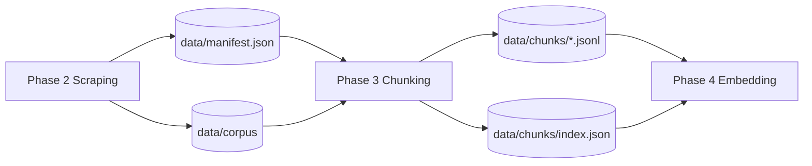
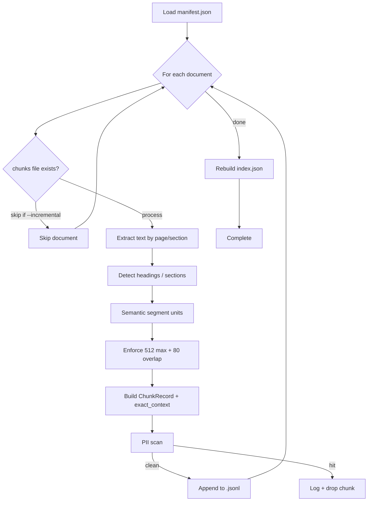
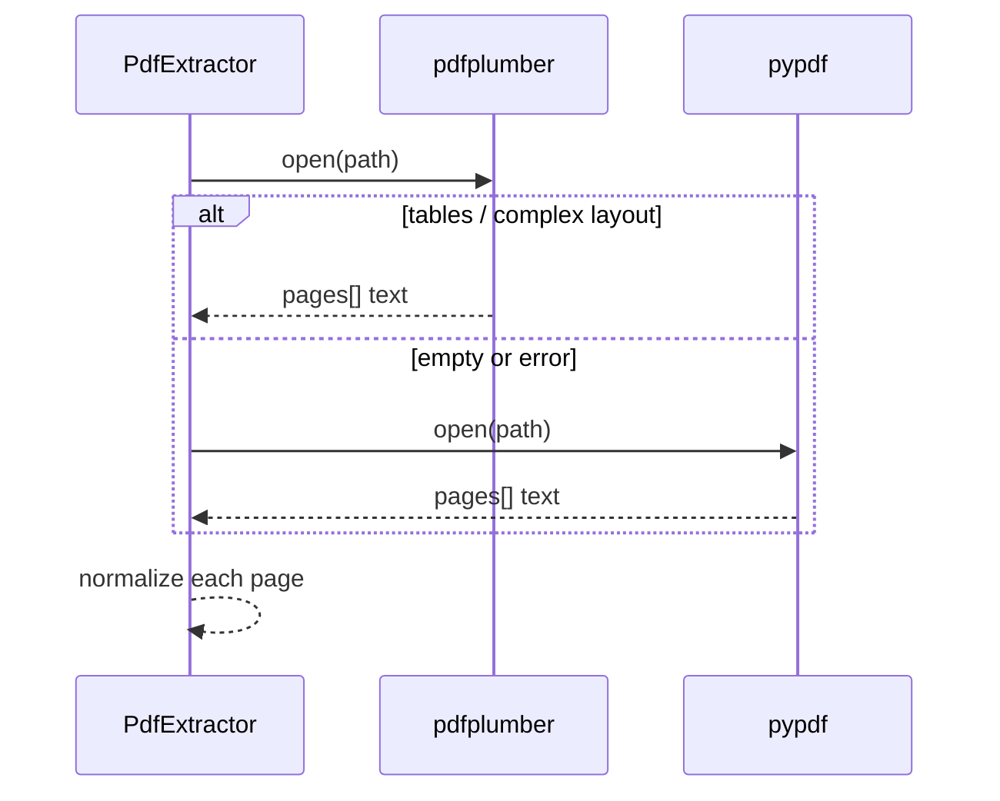
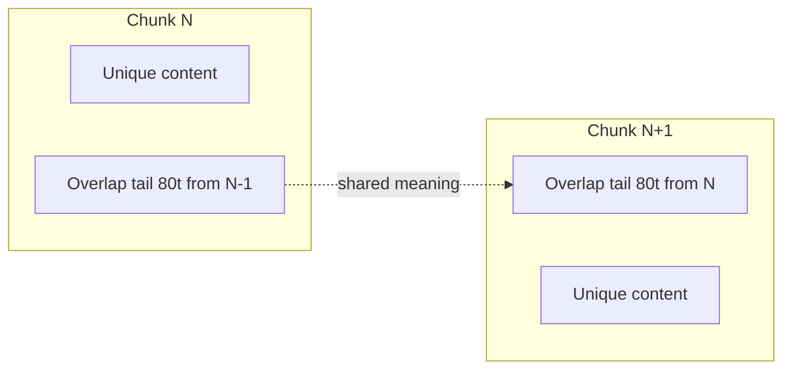

# Phase 3 — Document Processing & Semantic Chunking  
## In-Depth Architecture Specification

**Document version:** 1.0  
**Parent:** [architecture.md](./architecture.md) · [problemstatement.md](./problemstatement.md)  
**Prerequisite:** Phase 2 gate **PASS** (`data/manifest.json`, `data/corpus/`)  
**Feeds into:** Phase 4 (Vectorization & Chroma)  
**Last updated:** 2026-06-01

---

## Table of Contents

1. [Executive Summary](#1-executive-summary)
2. [Role in the End-to-End Pipeline](#2-role-in-the-end-to-end-pipeline)
3. [Design Goals & Non-Goals](#3-design-goals--non-goals)
4. [Inputs & Outputs](#4-inputs--outputs)
5. [High-Level Processing Flow](#5-high-level-processing-flow)
6. [Module & Directory Layout](#6-module--directory-layout)
7. [Phase 3.1 — Text Extraction](#7-phase-31--text-extraction)
8. [Phase 3.2 — Structure Detection](#8-phase-32--structure-detection)
9. [Phase 3.3 — Semantic Segmentation](#9-phase-33--semantic-segmentation)
10. [Phase 3.4 — Token Enforcement & Overlap](#10-phase-34--token-enforcement--overlap)
11. [Phase 3.5 — Chunk Identity & Metadata](#11-phase-35--chunk-identity--metadata)
12. [Phase 3.6 — Pipeline Orchestration & CLI](#12-phase-36--pipeline-orchestration--cli)
13. [Data Contracts & File Formats](#13-data-contracts--file-formats)
14. [Privacy & PII Handling](#14-privacy--pii-handling)
15. [Error Handling & Recovery](#15-error-handling--recovery)
16. [Idempotency & Incremental Runs](#16-idempotency--incremental-runs)
17. [Configuration Reference](#17-configuration-reference)
18. [Deep Test Gate (Phase 3)](#18-deep-test-gate-phase-3)
19. [Handoff to Phase 4](#19-handoff-to-phase-4)
20. [Risks & Mitigations](#20-risks--mitigations)

---

## 1. Executive Summary

Phase 3 transforms **raw corpus files** (PDF/HTML from Phase 2) into **search-ready text chunks** stored on disk. Each chunk is a semantically coherent passage—not a fixed character slice—bounded by **512 tokens maximum** with **80-token overlap** between neighbors so clinical meaning (e.g., drug contraindications spanning sentences) is not lost.

Every chunk carries **`exact_context`**: the verbatim text shown later in the HITL UI for `<mark>` highlighting and human verification. All chunks default to **`verification_status: unverified`**.

Phase 3 does **not** call embedding APIs or write to Chroma; that is Phase 4.

### 1.1 Free & fast alignment

| Goal | How Phase 3 meets it |
|------|----------------------|
| **$0** | Phases 3.1–3.6 use only local Python + open libraries (`pypdf`, `BeautifulSoup`, `tiktoken`). **No** Groq, **no** Hugging Face during chunking. |
| **Quick** | Structural path (3.2 + 3.3) is CPU-only; typical document processes in **under a few seconds**. |
| **Bounded work** | Inherits Phase 2 cap of **1,000 docs**; incremental mode skips unchanged outputs. |

Paid or slow options are **out of scope for v1**: sentence-transformers merge (v1.1), LLM-based chunking, cloud OCR for scanned PDFs.

See also: [architecture.md §2.3](./architecture.md#23-free--fast-alignment-non-negotiable).

---

## 2. Role in the End-to-End Pipeline



| Stage | Responsibility |
|-------|----------------|
| Phase 2 | Download & catalog documents |
| **Phase 3** | **Split documents → chunks + metadata** |
| Phase 4 | Embed chunks → `chroma_db` |
| Phase 5 | Retrieve chunks → Groq answer |
| Phase 6 | Human verifies `exact_context` in UI |

---

## 3. Design Goals & Non-Goals

### 3.1 Goals

| Goal | Rationale |
|------|-----------|
| **Semantic boundaries** | PRD forbids naive fixed-character blocks |
| **512 / 80 token policy** | Hard PRD limits for retrieval quality |
| **Stable `chunk_id`** | Idempotent re-runs; Phase 4 upsert key |
| **Verbatim `exact_context`** | PRD success criterion #3 (instant highlight) |
| **Page-aware metadata** | Citations show `page_number` for PDFs |
| **PII-safe output** | Re-scan chunks before write |
| **Manifest-driven** | Only process documents listed in `manifest.json` |

### 3.2 Non-Goals (Phase 3)

- No Hugging Face / embedding calls  
- No Chroma writes  
- No LLM summarization or paraphrasing of source text  
- No OCR for scanned PDFs (optional future enhancement)  
- No user-facing API (CLI + library only)

---

## 4. Inputs & Outputs

### 4.1 Inputs

| Input | Path | Producer |
|-------|------|----------|
| Document registry | `data/manifest.json` | Phase 2 |
| Raw files | `data/corpus/{dhr,icmr,nature}/*` | Phase 2 |
| Shared schemas | `src/shared/schemas.py` | Phase 1 |
| PII filter | `src/shared/pii_filter.py` | Phase 1 |

**Manifest record (reminder):**

```json
{
  "document_id": "sha256:4942ed487933e004",
  "source_org": "DHR",
  "source_url": "https://www.dhr.gov.in/...",
  "document_title": "National TB Policy Framework 2026",
  "publication_date": "2026-05-20",
  "content_type": "pdf",
  "local_path": "data/corpus/dhr/sha256_4942ed487933e004.pdf"
}
```

### 4.2 Outputs

| Output | Path | Consumer |
|--------|------|----------|
| Per-document chunk streams | `data/chunks/{document_id}.jsonl` | Phase 4 indexer |
| Global chunk index | `data/chunks/index.json` | Phase 4, debugging |
| Run log | `data/chunk_log.jsonl` | Ops / GHA audit |
| Phase report | `PHASES/Phase-03-Chunking/GATE_REPORT.md` | You |

---

## 5. High-Level Processing Flow



---

## 6. Module & Directory Layout

```
src/pipeline/
├── __init__.py
├── chunking/
│   ├── __init__.py
│   ├── run.py                 # CLI entry (Phase 3.6)
│   ├── orchestrator.py        # Manifest loop, logging
│   ├── models.py              # ChunkRecord, PageText
│   ├── extractors/
│   │   ├── __init__.py
│   │   ├── base.py            # Extractor protocol
│   │   ├── pdf_extractor.py   # pypdf + pdfplumber fallback
│   │   └── html_extractor.py  # BeautifulSoup → plain text
│   ├── structure/
│   │   └── detector.py        # Heading / section boundaries
│   ├── segmentation/
│   │   ├── semantic_segmenter.py   # StructuralSegmenter (production)
│   │   └── sentence_splitter.py
│   └── tokenization/
│       ├── tokenizer.py         # tiktoken cl100k_base
│       └── overlap.py           # 80-token sliding tail
tests/
├── phase3/
│   ├── test_extraction.py
│   ├── test_segmentation.py
│   ├── test_token_limits.py
│   ├── test_overlap_fixture.py
│   └── test_idempotency.py
├── fixtures/
│   └── phase3/
│       ├── sample_guideline.pdf
│       ├── contraindication_overlap.txt
│       └── sample_page.html
data/
└── chunks/
    ├── index.json
    ├── sha256_abc....jsonl
    └── ...
```

---

## 7. Phase 3.1 — Text Extraction

### 7.1 Objective

Convert each corpus file into **ordered page-level plain text** with normalized whitespace, suitable for medical guideline structure detection.

### 7.2 Extractor selection

| `content_type` | Primary | Fallback | Notes |
|----------------|---------|----------|-------|
| `pdf` | `pdfplumber` | `pypdf` | pdfplumber better for tables; pypdf for simple PDFs |
| `html` | `BeautifulSoup` | — | Strip script/style; preserve block breaks |

### 7.3 `PageText` model

```python
@dataclass
class PageText:
    page_number: int          # 1-based; HTML uses section index
    text: str                 # Normalized UTF-8 plain text
    source_path: str          # Echo from manifest.local_path
```

### 7.4 Normalization rules

1. Unicode NFC normalization  
2. Collapse `\r\n` → `\n`  
3. Collapse runs of spaces (not newlines) to single space  
4. Strip leading/trailing whitespace per page  
5. Remove null bytes and control chars except `\n` and `\t`  
6. Empty pages after strip → omit from downstream (do not emit zero-length chunks)

### 7.5 PDF-specific behavior



### 7.6 HTML-specific behavior

- Remove: `script`, `style`, `nav`, `footer`, `header` (heuristic)  
- Block tags (`p`, `h1`–`h6`, `li`, `div`) → newline-separated paragraphs  
- `page_number` = sequential section index (1, 2, 3…) for HTML-only Nature articles  

### 7.7 Extraction failure policy

| Condition | Action |
|-----------|--------|
| File missing on disk | Log `extraction_error`; skip document; do not delete manifest row |
| Encrypted PDF | Log; skip |
| Zero extractable text | Log `empty_document`; skip |
| Partial page failure | Keep successful pages; log warning |

---

## 8. Phase 3.2 — Structure Detection

### 8.1 Objective

Identify **logical section boundaries** before semantic merging/splitting—especially for ICMR/DHR guideline PDFs with numbered clauses and headings.

### 8.2 Heuristic signals

| Signal | Pattern | Weight |
|--------|---------|--------|
| Markdown-style heading | `^#{1,6}\s` (if present in text) | High |
| ALL CAPS line | Line length 4–80, mostly uppercase | Medium |
| Numbered section | `^\d+(\.\d+)*\s+[A-Z]` | High |
| Known medical headers | `Contraindications`, `Dosage`, `Introduction`, `Recommendations` | High |
| Blank line gap | `\n\n` between paragraphs | Low (paragraph boundary) |

### 8.3 Output: `SectionSpan`

```python
@dataclass
class SectionSpan:
    page_number: int
    start_char: int      # offset in page text
    end_char: int
    title: str | None
    text: str
```

### 8.4 Algorithm (per page)

```
sections = []
current_title = None
current_lines = []

for line in page.text.splitlines():
    if is_heading(line):
        if current_lines:
            sections.append(build_span(current_lines, current_title))
        current_title = line.strip()
        current_lines = []
    else:
        current_lines.append(line)

flush remaining → final section
```

Sections shorter than **20 characters** merge into the previous section to avoid micro-chunks before token pass.

---

## 9. Phase 3.3 — Structural Segmentation (Production Default)

> **Decision (2026-06-01):** Production uses **structural segmentation**, not embedding-based sentence clustering. PRD “semantic chunking” means **meaning-aware boundaries** (sections + sentences + overlap)—not fixed character windows. Optional embedding merge is deferred to **v1.1 (Nature-only)** if retrieval quality requires it.

### 9.1 Objective

Within each `SectionSpan` from §8, group sentences into **`TextUnit`** blobs (~400 tokens soft max) so contraindication paragraphs stay intact when possible—**without** crossing section boundaries.

### 9.2 Production mode: structural (implemented)

| Mode | Status | Description |
|------|--------|-------------|
| **Structural v1** | **ACTIVE** | §8 sections → sentence split → pack to `SOFT_MAX_TOKENS` (400) |
| Embedding v1.1 | Optional / future | `all-MiniLM-L6-v2` merge; consider **Nature-only** flag after Phase 5 eval |

**Implementation:** `src/pipeline/chunking/segmentation/semantic_segmenter.py` → class `StructuralSegmenter`

### 9.3 Unit construction algorithm

```
for each SectionSpan from Phase 3.2:
    sentences = split_sentences(section.text)   # Dr., e.g., No. guarded
    buffer = []
    for sentence in sentences:
        if buffer and count_tokens(buffer + sentence) > SOFT_MAX (400):
            emit TextUnit(buffer)
            buffer = [sentence]
        else:
            buffer.append(sentence)
    emit remaining buffer
```

| Rule | Value |
|------|-------|
| `SOFT_MAX_TOKENS` | 400 (headroom before 512 hard cap in §10) |
| Section boundary | **Never** merge sentences across spans |
| Overlap | Applied in **§10 only** (80 tokens between final chunks)—not during 3.3 unit packing |

### 9.4 `TextUnit` model

```python
@dataclass(frozen=True)
class TextUnit:
    page_number: int
    section_title: str | None
    text: str
    token_count: int
    sentence_count: int
```

**API:**

- `segment_structurally(sections) -> list[TextUnit]`
- `pages_to_units(pages) -> list[TextUnit]` — runs 3.2 + 3.3

### 9.5 Optional v1.1 (not in production v1)

If enabled later (`SEMANTIC_MERGE_SOURCES=Nature`):

1. Split into sentences (same as 9.3).  
2. Merge adjacent sentences while cosine similarity ≥ τ (default 0.72) using `all-MiniLM-L6-v2`.  
3. Then pack to soft max 400.

### 9.6 Why structure-first matters (PRD)

| Anti-pattern | Risk |
|--------------|------|
| Fixed 2000-character windows | Splits `"Do not use Bedaquiline with"` / `"strong CYP3A4 inducers"` across chunks |
| Page-only splits | Ignores continuation paragraphs |
| Semantic + overlap | Retrieval may fetch either chunk with full warning context |

---

## 10. Phase 3.4 — Token Enforcement & Overlap

### 10.1 Tokenizer

| Setting | Value |
|---------|-------|
| Library | `tiktoken` |
| Encoding | `cl100k_base` (aligned with common LLM tokenizers) |
| Hard max | **512 tokens** per chunk |
| Overlap | **80 tokens** from previous chunk tail |

### 10.2 Hard cap algorithm

```
function enforce_max_tokens(unit_text, max=512):
    ids = encode(unit_text)
    if len(ids) <= max:
        return unit_text
    # split at last sentence boundary where len(ids) <= max
    sentences = split_sentences(unit_text)
    chunk_sentences = []
    for s in sentences:
        if len(encode(join(chunk_sentences, s))) > max:
            break
        chunk_sentences.append(s)
    return join(chunk_sentences)
```

If a **single sentence** exceeds 512 tokens (rare tables), split by token window with overlap—log `oversized_sentence_split`.

### 10.3 Overlap algorithm

```python
def apply_overlap(prev_chunk_text: str, next_chunk_text: str, overlap_tokens: int = 80) -> str:
    tail_ids = encode(prev_chunk_text)[-overlap_tokens:]
    tail_text = decode(tail_ids)
    return tail_text + "\n" + next_chunk_text
```

**Invariant (test 3.6.2):** For fixture `contraindication_overlap.txt`, the drug warning phrase appears in **both** consecutive chunks' `exact_context` (in the overlap region).

### 10.4 Token counting diagram



---

## 11. Phase 3.5 — Chunk Identity & Metadata

### 11.1 `chunk_id` format

```
{document_id}::p{page_number:04d}::c{chunk_index:04d}
```

**Example:** `sha256:4942ed487933e004::p0024::c0003`

| Component | Stability rule |
|-----------|----------------|
| `document_id` | From Phase 2 hash |
| `page_number` | 1-based PDF page or HTML section index |
| `chunk_index` | Monotonic per page in processing order; reset per page |

**Idempotency:** Same manifest + same extractor version + same segmentation config → identical `chunk_id` set (test 3.6.4).

### 11.2 `ChunkRecord` (disk model)

```python
class ChunkRecord(BaseModel):
    chunk_id: str
    document_id: str
    source_org: SourceOrg
    source_url: str
    document_title: str
    publication_year: int
    page_number: int
    chunk_index: int
    exact_context: str          # Verbatim chunk text — NEVER paraphrase
    token_count: int
    char_count: int
    verification_status: VerificationStatus = UNVERIFIED
    content_hash: str           # sha256(exact_context) for change detection
    created_at: str             # ISO UTC
```

### 11.3 `publication_year`

Derived from `manifest.publication_date` (`YYYY-MM-DD` → int year). Used in Phase 4 Chroma metadata.

### 11.4 `exact_context` rules

1. Must be a **contiguous substring** of extracted source text (after normalization).  
2. Max length: whatever fits in 512 tokens (typically ≤ ~2,500 chars).  
3. No HTML tags in stored value (plain text only).  
4. Used **as-is** in Phase 6 `<mark>` highlighting—do not trim medically significant punctuation.

---

## 12. Phase 3.6 — Pipeline Orchestration & CLI

### 12.1 CLI

```bash
# Process all manifest documents
python -m pipeline.chunking.run --manifest data/manifest.json

# Only one document
python -m pipeline.chunking.run --document-id sha256:4942ed487933e004

# Rebuild only missing outputs
python -m pipeline.chunking.run --incremental

# Force rebuild all chunk files
python -m pipeline.chunking.run --force
```

### 12.2 Orchestrator responsibilities

| Step | Action |
|------|--------|
| Load manifest | Validate `schema_version` |
| Filter | Skip rows with missing `local_path` |
| Extract → segment → tokenize | Per §7–10 |
| PII scan | Per §14 |
| Write | One JSONL per `document_id` |
| Index | Rebuild `data/chunks/index.json` |
| Log | Append `data/chunk_log.jsonl` |

### 12.3 `index.json` schema

```json
{
  "schema_version": "1",
  "generated_at": "2026-06-01T12:00:00Z",
  "total_chunks": 1240,
  "documents": [
    {
      "document_id": "sha256:4942ed487933e004",
      "chunk_file": "data/chunks/sha256_4942ed487933e004.jsonl",
      "chunk_count": 18,
      "content_hash": "sha256:aggregate..."
    }
  ]
}
```

`chunk_file` uses filesystem-safe name: `document_id` with `:` → `_`.

---

## 13. Data Contracts & File Formats

### 13.1 JSONL line format (one chunk per line)

```json
{
  "chunk_id": "sha256:4942ed487933e004::p0001::c0001",
  "document_id": "sha256:4942ed487933e004",
  "source_org": "DHR",
  "source_url": "https://www.dhr.gov.in/documents/publications/tb-policy-2026.pdf",
  "document_title": "National TB Policy Framework 2026",
  "publication_year": 2026,
  "page_number": 1,
  "chunk_index": 1,
  "exact_context": "For multi-drug resistant strains...",
  "token_count": 487,
  "char_count": 2104,
  "verification_status": "unverified",
  "content_hash": "a1b2c3...",
  "created_at": "2026-06-01T12:00:01Z"
}
```

### 13.2 Mapping to Phase 4 Chroma metadata

| ChunkRecord field | Chroma metadata key |
|-------------------|---------------------|
| `source_url` | `source_url` |
| `document_title` | `document_title` |
| `publication_year` | `publication_year` |
| `page_number` | `page_number` |
| `exact_context` | `exact_context` |
| `verification_status` | `verification_status` |
| `source_org` | `source_org` |
| `chunk_id` | `chunk_id` (also Chroma document id) |

**Chroma document ID:** use `chunk_id` string directly (unique globally).

---

## 14. Privacy & PII Handling

### 14.1 When to scan

| Point | Action |
|-------|--------|
| After `exact_context` finalized | `scan_text(exact_context)` |
| On PII hit | **Do not write chunk**; log `pii_chunk_dropped` with `violations[]` |
| Document-level escalation | If >30% chunks dropped → log `document_pii_review` |

### 14.2 Patterns (from Phase 1)

Aadhaar, PAN, phone, email, inline credentials—see `src/shared/pii_filter.py`.

### 14.3 No new PII introduction

Chunking must **never** inject synthetic patient examples into `exact_context`.

---

## 15. Error Handling & Recovery

| Error | Handling |
|-------|----------|
| Corrupt PDF | Skip doc; `chunk_log` event |
| Encoding error | Try UTF-8 with `errors=replace`; log warning |
| Out of disk | Fail fast with clear message |
| Partial write | Write to `{id}.jsonl.tmp` then atomic rename |
| Keyboard interrupt | Complete current document; save index |

---

## 16. Idempotency & Incremental Runs

### 16.1 Default (`--incremental`)

- If `data/chunks/{safe_document_id}.jsonl` exists **and** manifest `ingested_at` ≤ stored sidecar `source_ingested_at` → skip.  
- If manifest row updated (re-ingested file) → re-chunk and replace JSONL.

### 16.2 Sidecar file (optional)

`data/chunks/{safe_document_id}.meta.json`:

```json
{
  "document_id": "sha256:4942ed487933e004",
  "source_ingested_at": "2026-06-01T00:30:00Z",
  "chunk_count": 18,
  "pipeline_version": "1.0.0"
}
```

### 16.3 Force rebuild

`--force` deletes per-doc JSONL and rebuilds from scratch.

---

## 17. Configuration Reference

| Env / setting | Default | Description |
|---------------|---------|-------------|
| `CORPUS_PATH` | `./data/corpus` | Input files |
| `CHUNK_OUTPUT_DIR` | `./data/chunks` | JSONL output |
| `CHUNK_MAX_TOKENS` | `512` | Hard cap |
| `CHUNK_OVERLAP_TOKENS` | `80` | Overlap size |
| `CHUNK_SOFT_MAX_TOKENS` | `400` | Semantic unit target |
| `TOKEN_ENCODING` | `cl100k_base` | tiktoken encoding |

---

## 18. Deep Test Gate (Phase 3)

| ID | Test | Pass criteria |
|----|------|---------------|
| 3.6.1 | Token ceiling | No chunk > 512 tokens on ICMR sample |
| 3.6.2 | Overlap integrity | Contraindication fixture in overlap region |
| 3.6.3 | Metadata completeness | All `ChunkRecord` fields present |
| 3.6.4 | Idempotency | Two runs → identical `chunk_id` set |
| 3.6.5 | Regression | Phase 1 + 2 tests pass |
| 3.6.6 | Gate report | `PHASES/Phase-03-Chunking/GATE_REPORT.md` |

### 18.1 Test fixtures required

| Fixture | Purpose |
|---------|---------|
| `tests/fixtures/phase3/sample_guideline.pdf` | Multi-page PDF extraction |
| `tests/fixtures/phase3/contraindication_overlap.txt` | Overlap span test |
| `tests/fixtures/phase3/sample_page.html` | HTML extraction |

---

## 19. Handoff to Phase 4

Phase 4 indexer **reads**:

1. `data/chunks/index.json` — document list  
2. Each `data/chunks/{document_id}.jsonl` — line-delimited `ChunkRecord`  
3. Uses `content_hash` to skip unchanged chunks on re-embed  
4. On `manifest.pruned_document_ids` from Phase 2 → delete all Chroma entries with matching `document_id` prefix in `chunk_id`

**Deliverable checklist for Phase 3 sign-off:**

- [ ] All manifest documents processed or explicitly logged as skipped  
- [ ] `index.json` `total_chunks` > 0  
- [ ] Sample chunk opens in editor with readable `exact_context`  
- [ ] No chunk > 512 tokens in audit script  

---

## 20. Risks & Mitigations

| Risk | Impact | Mitigation |
|------|--------|------------|
| Poor PDF extraction (scanned docs) | Empty/garbage chunks | pdfplumber + pypdf fallback; skip empty |
| Tokenizer ≠ Groq tokenizer | Slight count drift | Conservative 512 cap; monitor |
| Very large manifest (1000 docs) | Long chunk job | Incremental mode; per-doc JSONL parallelism (future) |
| Nature HTML boilerplate | Noisy chunks | Strip nav/footer in HTML extractor |
| Re-chunk without re-embed | Stale vectors | Phase 4 uses `content_hash` to detect changes |

---

*End of Phase 3 architecture. Implementation must follow [architecture.md](./architecture.md) gate protocol before starting Phase 4.*
