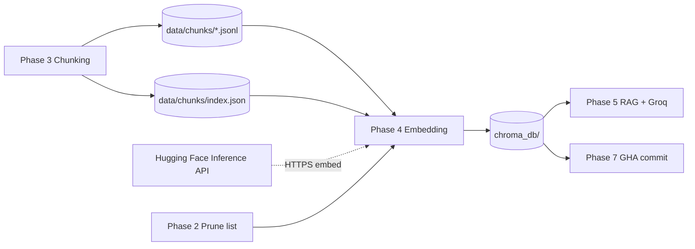
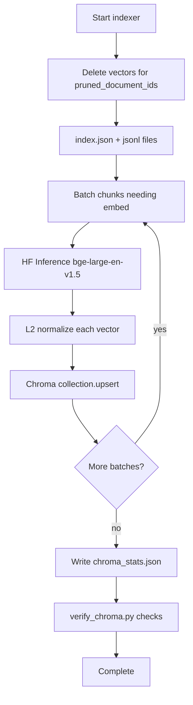
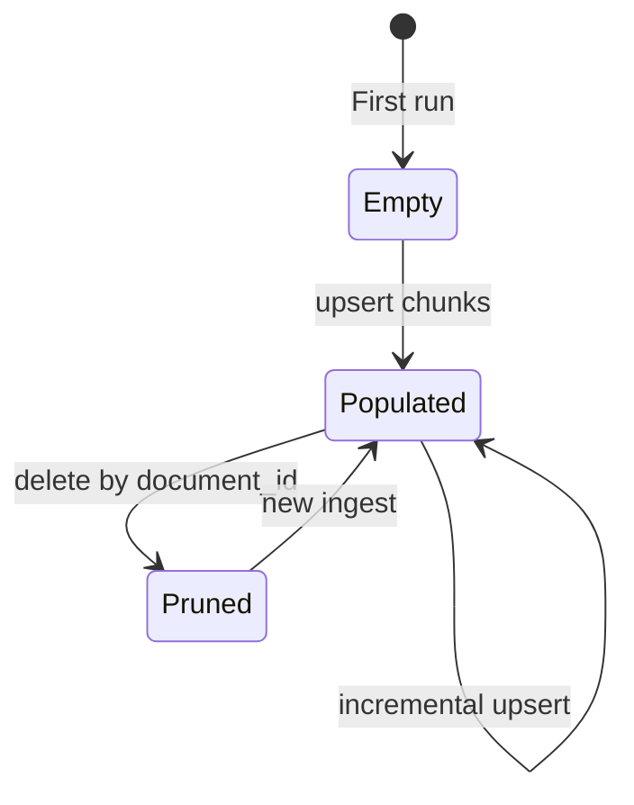
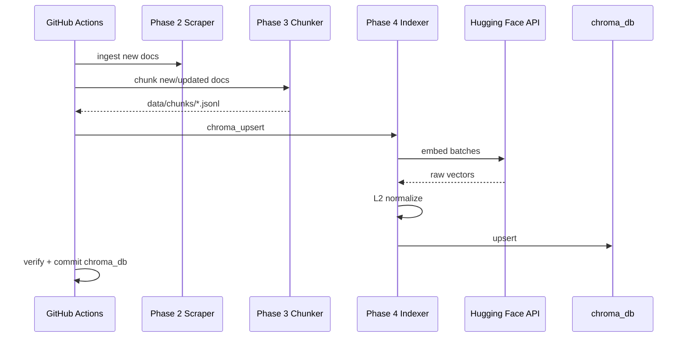

# Phase 4 — Vectorization & Local Vector Store  
## In-Depth Architecture Specification

**Document version:** 1.0  
**Parent:** [architecture.md](./architecture.md) · [problemstatement.md](./problemstatement.md)  
**Prerequisite:** Phase 3 gate **PASS** (`data/chunks/`, `data/chunks/index.json`)  
**Feeds into:** Phase 5 (RAG Backend + Groq on Streamlit)  
**Last updated:** 2026-06-01

---

## Table of Contents

1. [Executive Summary](#1-executive-summary)
2. [Role in the End-to-End Pipeline](#2-role-in-the-end-to-end-pipeline)
3. [Design Goals & Non-Goals](#3-design-goals--non-goals)
4. [Inputs & Outputs](#4-inputs--outputs)
5. [High-Level Processing Flow](#5-high-level-processing-flow)
6. [Module & Directory Layout](#6-module--directory-layout)
7. [Phase 4.1 — Hugging Face BGE Embedding Client](#7-phase-41--hugging-face-bge-embedding-client)
8. [Phase 4.2 — L2 Normalization](#8-phase-42--l2-normalization)
9. [Phase 4.3 — Chroma PersistentClient Integration](#9-phase-43--chromadb-persistentclient-integration)
10. [Phase 4.4 — Upsert, Delete & Prune Cascade](#10-phase-44--upsert-delete--prune-cascade)
11. [Phase 4.5 — Index Verification & Operations](#11-phase-45--index-verification--operations)
12. [Retrieval Contract (Phase 5 Preview)](#12-retrieval-contract-phase-5-preview)
13. [Data & ID Strategy](#13-data--id-strategy)
14. [Batching, Rate Limits & Cost Control](#14-batching-rate-limits--cost-control)
15. [Configuration Reference](#15-configuration-reference)
16. [Error Handling & Recovery](#16-error-handling--recovery)
17. [Security & Secrets](#17-security--secrets)
18. [Deep Test Gate (Phase 4)](#18-deep-test-gate-phase-4)
19. [GitHub Actions & Artifact Handoff](#19-github-actions--artifact-handoff)
20. [Handoff to Phase 5](#20-handoff-to-phase-5)
21. [Risks & Mitigations](#21-risks--mitigations)

---

## 1. Executive Summary

Phase 4 converts **text chunks** (Phase 3) into **dense vector embeddings** using **BAAI/bge-large-en-v1.5** via the **Hugging Face Inference API**, applies **L2 normalization**, and persists vectors plus full metadata in a **local Chroma database** at `./chroma_db`—no cloud vector service.

Each vector is keyed by **`chunk_id`** and carries PRD-mandated metadata including **`exact_context`** and **`verification_status`** (default `unverified`). Phase 4 enables **offline similarity search** for the RAG backend in Phase 5.

---

## 2. Role in the End-to-End Pipeline



| Property | Value |
|----------|-------|
| Vector DB location | `./chroma_db` (on disk) |
| Collection name | `india_medical_local` |
| Similarity metric | Cosine (on L2-normalized vectors) |
| Network at query time (Phase 5) | **No** remote vector DB—local Chroma only |

This satisfies PRD success criterion **#2** (zero cloud vector DB crashes during retrieval).

---

## 3. Design Goals & Non-Goals

### 3.1 Goals

| Goal | Rationale |
|------|-----------|
| **PRD model** | `BAAI/bge-large-en-v1.5` via HF Inference |
| **L2 normalize** | PRD formula; cosine via dot product |
| **Local persistence** | `chromadb.PersistentClient` |
| **Full metadata payload** | HITL highlight + citations |
| **Upsert by `chunk_id`** | Idempotent daily ingest |
| **Cascade delete** | Phase 2 prune removes orphan vectors |
| **Skip unchanged chunks** | `content_hash` from Phase 3 |

### 3.2 Non-Goals (Phase 4)

- No Groq / LLM calls  
- No Streamlit or Vercel deployment  
- No query-time embedding cache cluster (single-process Chroma is sufficient)  
- No fine-tuning BGE  
- No multi-collection sharding (single collection for portfolio)

---

## 4. Inputs & Outputs

### 4.1 Inputs

| Input | Path / source | Description |
|-------|---------------|-------------|
| Chunk files | `data/chunks/{safe_doc_id}.jsonl` | One JSON object per line (`ChunkRecord`) |
| Chunk index | `data/chunks/index.json` | Manifest of chunk files |
| Prune list | `data/manifest.json` → `pruned_document_ids` | Phase 2 cascade deletes |
| HF token | `HUGGINGFACE_API_TOKEN` | Inference API auth |
| Existing index | `chroma_db/` | Prior runs (incremental upsert) |

### 4.2 Outputs

| Output | Path | Description |
|--------|------|-------------|
| Chroma persistence | `chroma_db/` | SQLite + index files (Chroma managed) |
| Embed log | `data/embed_log.jsonl` | Per-batch audit |
| Index stats | `data/chroma_stats.json` | Counts, last run, dimension |
| Phase report | `PHASES/Phase-04-Embedding/GATE_REPORT.md` | Gate sign-off |

---

## 5. High-Level Processing Flow



---

## 6. Module & Directory Layout

```
src/pipeline/
├── embeddings/
│   ├── __init__.py
│   ├── bge_client.py           # HF Inference wrapper (Phase 4.1)
│   ├── normalize.py            # L2 math (Phase 4.2)
│   └── batch_planner.py        # Token/batch sizing
├── index/
│   ├── __init__.py
│   ├── chroma_upsert.py        # CLI entry (Phase 4.4)
│   ├── orchestrator.py         # Full index run
│   ├── delete.py               # Prune cascade
│   └── mapper.py               # ChunkRecord → Chroma record
scripts/
└── verify_chroma.py            # Phase 4.5 health script
tests/
├── phase4/
│   ├── test_bge_client_mock.py
│   ├── test_l2_normalize.py
│   ├── test_chroma_upsert.py
│   ├── test_prune_cascade.py
│   └── test_offline_query.py
chroma_db/                      # Git-tracked per portfolio (may use LFS)
data/
├── embed_log.jsonl
└── chroma_stats.json
```

---

## 7. Phase 4.1 — Hugging Face BGE Embedding Client

### 7.1 Model specification

| Property | Value |
|----------|-------|
| Model ID | `BAAI/bge-large-en-v1.5` |
| Provider | Hugging Face **Inference API** (serverless) |
| Task | Feature extraction / sentence embeddings |
| Expected dimension | **1024** (verify on first live call) |
| Query prefix (retrieval) | For Phase 5 queries: prepend `"query: "` per BGE convention |
| Passage prefix | Prepend `"passage: "` to `exact_context` at embed time |

### 7.2 API client design

```python
class BgeEmbeddingClient:
  def __init__(self, api_token: str, model_id: str = "BAAI/bge-large-en-v1.5"):
      ...

  def embed_passages(self, texts: list[str]) -> list[list[float]]:
      """Batch embed with 'passage: ' prefix."""

  def embed_query(self, text: str) -> list[float]:
      """Single query with 'query: ' prefix — used in Phase 5."""
```

### 7.3 HTTP integration (conceptual)

| Setting | Value |
|---------|-------|
| Base URL | `https://api-inference.huggingface.co` |
| Endpoint | `/pipeline/feature-extraction/{model_id}` or Inference Providers route per HF SDK version |
| Auth header | `Authorization: Bearer {HUGGINGFACE_API_TOKEN}` |
| Timeout | 60s per batch |
| Retries | 3 with exponential backoff on 429, 503 |

Use official `huggingface_hub.InferenceClient` where possible to track API changes.

### 7.4 Request batching

| Parameter | Default | Notes |
|-----------|---------|-------|
| `EMBED_BATCH_SIZE` | 16 | Reduce on 413 / OOM |
| Max chars per request | ~24,000 total | Split batch if exceeded |
| Input field | `exact_context` only | Do not embed metadata keys |

### 7.5 Mock mode (tests / offline)

| Mode | Behavior |
|------|----------|
| `EMBED_MOCK=true` | Deterministic 1024-d vector from `sha256(text)` |
| Unit tests | Never call live HF without `@pytest.mark.live` |

---

## 8. Phase 4.2 — L2 Normalization

### 8.1 PRD formula

\[
\|\mathbf{v}\|_2 = \sqrt{\sum_i v_i^2}, \quad \mathbf{v}_{\text{norm}} = \frac{\mathbf{v}}{\|\mathbf{v}\|_2}
\]

**Target:** \(\|\mathbf{v}_{\text{norm}}\|_2 = 1\) within floating-point tolerance \(\epsilon = 10^{-5}\).

### 8.2 Implementation

```python
import math

def l2_normalize(vector: list[float]) -> list[float]:
    norm = math.sqrt(sum(x * x for x in vector))
    if norm == 0.0:
        raise ValueError("Zero vector cannot be normalized")
    return [x / norm for x in vector]
```

Use `numpy` optionally for speed on large batches—not required for portfolio scale.

### 8.3 Why normalize

| Reason | Detail |
|--------|--------|
| PRD compliance | Explicit requirement |
| Cosine similarity | For unit vectors, \(\cos(\theta) = \mathbf{v}_1 \cdot \mathbf{v}_2\) |
| Chroma `hnsw:space` | Set collection metadata to `cosine` |

### 8.4 Validation (test 4.6.2)

For every embedding written:

```python
assert abs(l2_norm(vec) - 1.0) < 1e-5
```

---

## 9. Phase 4.3 — Chroma PersistentClient Integration

### 9.1 Initialization (PRD-aligned)

```python
import chromadb

client = chromadb.PersistentClient(path="./chroma_db")
collection = client.get_or_create_collection(
    name="india_medical_local",
    metadata={
        "hnsw:space": "cosine",
        "schema_version": "1",
        "embedding_model": "BAAI/bge-large-en-v1.5",
    },
)
```

`CHROMA_PATH` env overrides `./chroma_db`.

### 9.2 Storage layout (Chroma-managed)

```
chroma_db/
├── chroma.sqlite3
└── ...                         # HNSW index segments (Chroma version-dependent)
```

**Do not hand-edit** files while indexer is running.

### 9.3 Chroma record mapping

| Chroma field | Source |
|--------------|--------|
| `ids` | `chunk_id` |
| `documents` | `exact_context` (optional but useful for debug) |
| `embeddings` | L2-normalized vector |
| `metadatas` | `ChunkMetadata.to_chroma_metadata()` |

### 9.4 Required metadata payload (PRD)

```python
metadata_payload = {
    "source_url": "https://www.icmr.gov.in/pdf/guidelines/tb_protocol_2026.pdf",
    "document_title": "National Operational Guidelines for Pulmonary Tuberculosis - Update",
    "publication_year": 2026,
    "page_number": 24,
    "exact_context": "For multi-drug resistant strains, administer Bedaquiline...",
    "verification_status": "unverified",
    "source_org": "ICMR",
    "chunk_id": "sha256:abc::p0024::c0003",
}
```

**Chroma metadata constraints:**

- Values must be `str`, `int`, `float`, or `bool`  
- Store `publication_year` as `int`  
- `page_number` as `int`  
- No nested objects

### 9.5 Collection lifecycle



---

## 10. Phase 4.4 — Upsert, Delete & Prune Cascade

### 10.1 Upsert logic

```
for chunk in all_chunks_from_phase3:
    if chroma.get(chunk_id) exists:
        if stored content_hash == chunk.content_hash:
            continue  # skip re-embed
    vector = l2_normalize(embed_passage(chunk.exact_context))
    collection.upsert(
        ids=[chunk.chunk_id],
        embeddings=[vector],
        documents=[chunk.exact_context],
        metadatas=[chunk.to_chroma_metadata()],
    )
```

### 10.2 Prune cascade (Phase 2 integration)

When `data/manifest.json` contains:

```json
"pruned_document_ids": ["sha256:old001", "sha256:old002"]
```

**Delete all Chroma IDs** where `chunk_id` starts with `{document_id}::` OR metadata filter:

```python
# Pseudocode — prefer get-by-prefix if chunk_id encodes document_id
for doc_id in pruned_document_ids:
    prefix = f"{doc_id}::"
    ids_to_delete = [id for id in collection.get() if id.startswith(prefix)]
    collection.delete(ids=ids_to_delete)
```

After successful delete, **clear** processed IDs from manifest's `pruned_document_ids` list (optional, log either way).

Also delete stale `data/chunks/{doc}.jsonl` in Phase 3 cleanup (coordination note in gate).

### 10.3 Verification status preservation

| Event | `verification_status` behavior |
|-------|-------------------------------|
| New chunk | `unverified` |
| Re-embed same `chunk_id`, text unchanged | Keep existing status if present |
| Re-embed text changed (`content_hash`) | Reset to `unverified` |
| Human verified in Phase 5/6 | PATCH updates Chroma metadata in place |

### 10.4 CLI

```bash
# Full index from Phase 3 outputs
python -m pipeline.index.chroma_upsert

# Process prune list only
python -m pipeline.index.chroma_upsert --prune-only

# Dry-run counts
python -m pipeline.index.chroma_upsert --dry-run
```

---

## 11. Phase 4.5 — Index Verification & Operations

### 11.1 `scripts/verify_chroma.py`

| Check | Pass condition |
|-------|----------------|
| Collection exists | `india_medical_local` present |
| Count | `collection.count() == expected` (±0 if dry-run known) |
| Sample query | Embedding a test string returns `n_results` > 0 |
| Persistence | Close client, reopen, count unchanged |
| Norm spot-check | 10 random vectors ‖v‖₂ ≈ 1 |
| Metadata keys | All required keys on sample |

### 11.2 `data/chroma_stats.json`

```json
{
  "schema_version": "1",
  "collection": "india_medical_local",
  "total_vectors": 1240,
  "embedding_model": "BAAI/bge-large-en-v1.5",
  "embedding_dimension": 1024,
  "last_indexed_at": "2026-06-01T14:00:00Z",
  "chunks_skipped_unchanged": 320,
  "chunks_embedded": 92,
  "chunks_deleted": 15
}
```

### 11.3 Operational commands (local)

```powershell
$env:PYTHONPATH="src"
$env:HUGGINGFACE_API_TOKEN="hf_..."
python -m pipeline.index.chroma_upsert
python scripts/verify_chroma.py
```

---

## 12. Retrieval Contract (Phase 5 Preview)

Phase 4 must enable Phase 5 retriever with this interface:

```python
def retrieve(query: str, top_k: int = 8) -> list[ChunkMetadata]:
    q_vec = l2_normalize(client.embed_query(query))
    results = collection.query(
        query_embeddings=[q_vec],
        n_results=top_k,
        include=["metadatas", "documents", "distances"],
    )
    return parse_results(results)
```

| Parameter | Default | Notes |
|-----------|---------|-------|
| `top_k` | 8 | Fits Groq free-tier context budget |
| Distance | Chroma returns cosine **distance** | Convert to similarity if needed: `1 - distance` |

**No remote vector DB** at query time—only local `PersistentClient`.

---

## 13. Data & ID Strategy

### 13.1 Primary key

- **Chroma ID = `chunk_id`** globally unique  
- Format: `{document_id}::p{page}::c{index}` (from Phase 3)

### 13.2 Secondary indexes (logical)

| Lookup | Method |
|--------|--------|
| By `document_id` | Prefix scan on `chunk_id` or metadata filter |
| By `source_org` | `collection.get(where={"source_org": "ICMR"})` |
| By verification | `where={"verification_status": "unverified"}` |

Chroma `where` filters are sufficient for portfolio scale (<100k chunks).

### 13.3 `content_hash` sync

| Phase 3 field | Phase 4 use |
|---------------|-------------|
| `content_hash` | Skip re-embed if unchanged |
| Changed hash | Upsert + reset `verification_status` |

---

## 14. Batching, Rate Limits & Cost Control

### 14.1 Hugging Face free tier considerations

| Risk | Mitigation |
|------|------------|
| 429 rate limit | Exponential backoff; reduce `EMBED_BATCH_SIZE` |
| Cold model start | Retry after `estimated_time` in error body |
| Token limits per request | Smaller batches |

### 14.2 Incremental daily ingest (Phase 7)

Typical GHA run after new Nature papers:

1. Phase 2 adds ~5–50 new documents  
2. Phase 3 adds chunk JSONL files  
3. Phase 4 embeds **only new/changed** chunks (hash skip)  
4. Commits updated `chroma_db/` to git  

### 14.3 Embedding volume estimate

| Corpus | Chunks (est.) | HF calls (batch=16) |
|--------|---------------|---------------------|
| 1000 docs × ~15 chunks | ~15,000 | ~940 batches |

Plan **< 30 min** total index time on GHA with backoff (architecture Phase 7 target).

---

## 15. Configuration Reference

| Variable | Default | Description |
|----------|---------|-------------|
| `HUGGINGFACE_API_TOKEN` | — | **Required** for live embed |
| `CHROMA_PATH` | `./chroma_db` | Persistence directory |
| `CHROMA_COLLECTION` | `india_medical_local` | Collection name |
| `EMBED_BATCH_SIZE` | `16` | Texts per HF request |
| `EMBED_MODEL_ID` | `BAAI/bge-large-en-v1.5` | HF model |
| `EMBED_MOCK` | `false` | Deterministic vectors for tests |
| `CHUNK_INDEX_PATH` | `./data/chunks/index.json` | Phase 3 index |

---

## 16. Error Handling & Recovery

| Failure | Policy |
|---------|--------|
| HF 503 / model loading | Retry up to 3×; fail job if exhausted |
| HF 401 | Fail fast—bad token |
| Single chunk embed error | Log + skip chunk; do not abort entire run |
| Chroma lock error | Ensure single writer; retry 2× |
| Partial upsert crash | Re-run idempotent upsert |
| Dimension mismatch | Fail—model swap detected |

**Never commit** a corrupted `chroma_db` from a failed mid-write run—GHA should run `verify_chroma.py` before git commit.

---

## 17. Security & Secrets

| Rule | Detail |
|------|--------|
| Token storage | `.env` locally; GitHub Secrets in GHA |
| Never log | Full API token or raw embeddings |
| Corpus text | Already PII-scanned in Phases 2–3 |
| `chroma_db` in git | Portfolio artifact—no secrets inside |

---

## 18. Deep Test Gate (Phase 4)

| ID | Test | Pass criteria |
|----|------|---------------|
| 4.6.1 | Embedding dimensions | All vectors dim = 1024 (or live-verified) |
| 4.6.2 | L2 norm | \(\|v\|_2 - 1\| < 10^{-5}\) |
| 4.6.3 | Offline query | top-k works with no remote vector DB |
| 4.6.4 | Restart persistence | Close/reopen client; data intact |
| 4.6.5 | Prune cascade | Delete doc → 0 matching chunks in Chroma |
| 4.6.6 | Regression | Phases 1–3 tests pass |
| 4.6.7 | Gate report | `PHASES/Phase-04-Embedding/GATE_REPORT.md` |

### 18.1 Live vs mock matrix

| Test file | HF network |
|-----------|------------|
| `test_l2_normalize.py` | No |
| `test_chroma_upsert.py` | Mock embed |
| `test_prune_cascade.py` | Mock embed |
| `test_bge_live.py` | Optional `@pytest.mark.live` |

---

## 19. GitHub Actions & Artifact Handoff

Phase 7 pipeline segment (preview):

```yaml
- run: python -m pipeline.chunking.run
- run: python -m pipeline.index.chroma_upsert
  env:
    HUGGINGFACE_API_TOKEN: ${{ secrets.HUGGINGFACE_API_TOKEN }}
- run: python scripts/verify_chroma.py
- uses: stefanzweifel/git-auto-commit-action@v5
  with:
    file_pattern: chroma_db/** data/chroma_stats.json data/embed_log.jsonl
```

| Artifact | Committed? | Size note |
|----------|------------|-----------|
| `chroma_db/` | Yes (PRD) | Monitor; use Git LFS if >100MB |
| `data/chunks/` | Optional | Can regenerate from corpus |
| `data/embed_log.jsonl` | Yes | Audit trail |

---

## 20. Handoff to Phase 5

Phase 5 **Streamlit + FastAPI** backend expects:

| Capability | Provided by Phase 4 |
|------------|---------------------|
| `retrieve(query, top_k)` | Local Chroma query |
| Metadata for citations | `exact_context`, `source_url`, `page_number`, etc. |
| `verification_status` updates | Chroma metadata PATCH |
| Health check | `collection.count() > 0` |

**Environment variables for Phase 5:**

- `CHROMA_PATH` (same as Phase 4)  
- `HUGGINGFACE_API_TOKEN` (query embedding only—can share client with Phase 4 code)  
- `GROQ_API_KEY` (generation—not Phase 4)

---

## 21. Risks & Mitigations

| Risk | Impact | Mitigation |
|------|--------|------------|
| HF API outage | Stale index | Retry GHA; keep last good `chroma_db` commit |
| Model revision changes dim | Chroma query errors | Pin model revision; verify dim on startup |
| Large `chroma_db` git clone | Slow repo | Git LFS; prune corpus at 1000 docs |
| Query/passage prefix omitted | Lower retrieval quality | Enforce in `BgeEmbeddingClient` |
| Verification reset on re-embed | User re-work | Only reset when `content_hash` changes |
| Chroma version upgrade | Index incompatibility | Pin `chromadb` in `requirements.txt` |

---

## Appendix A — Phase 3 ↔ Phase 4 Field Mapping

| Phase 3 `ChunkRecord` | Phase 4 Chroma |
|-----------------------|----------------|
| `chunk_id` | `id` + `metadata.chunk_id` |
| `exact_context` | `document` + `metadata.exact_context` |
| `source_url` | `metadata.source_url` |
| `document_title` | `metadata.document_title` |
| `publication_year` | `metadata.publication_year` |
| `page_number` | `metadata.page_number` |
| `source_org` | `metadata.source_org` |
| `verification_status` | `metadata.verification_status` |
| `content_hash` | Not stored in Chroma (used only at index time) |

---

## Appendix B — Sequence: Daily Index Run



---

*End of Phase 4 architecture. Implement only after Phase 3 gate **PASS** and user permission per [PHASES/README.md](../PHASES/README.md).*
