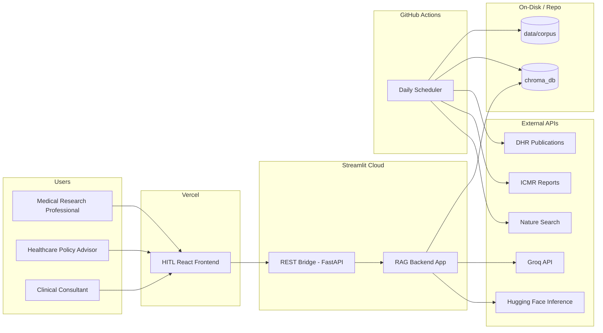
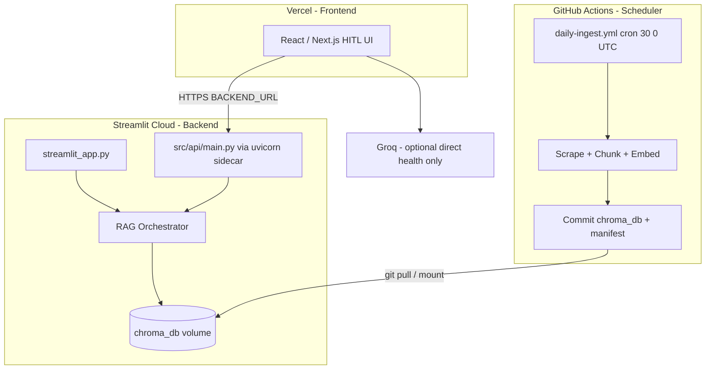
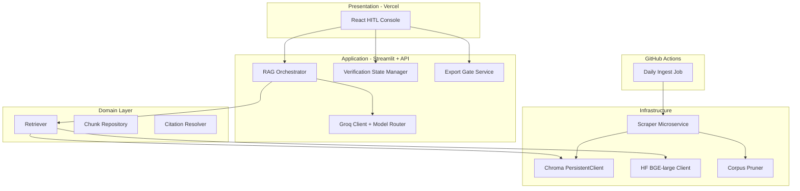
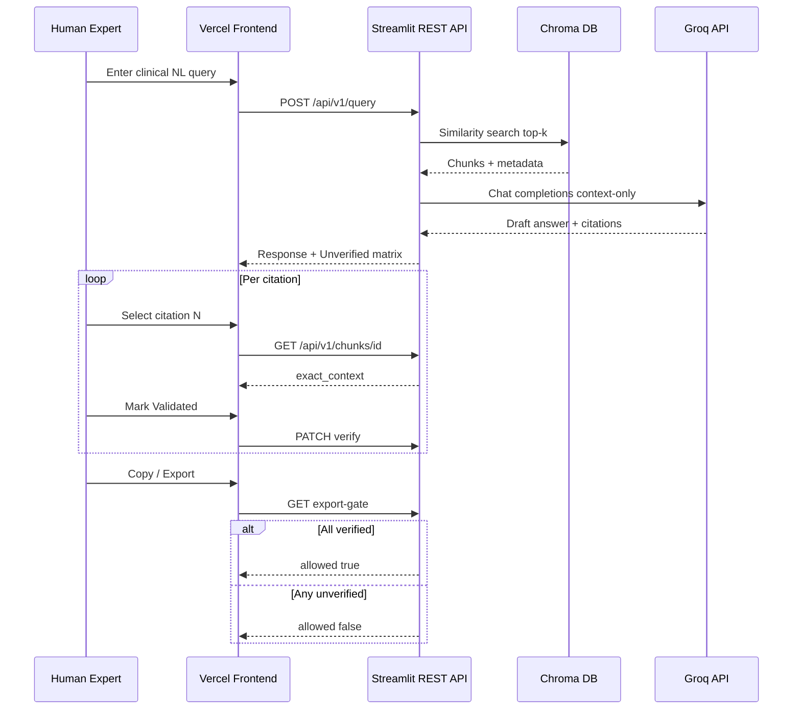
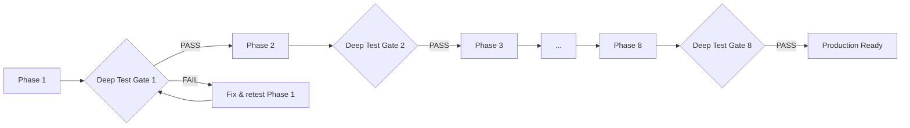
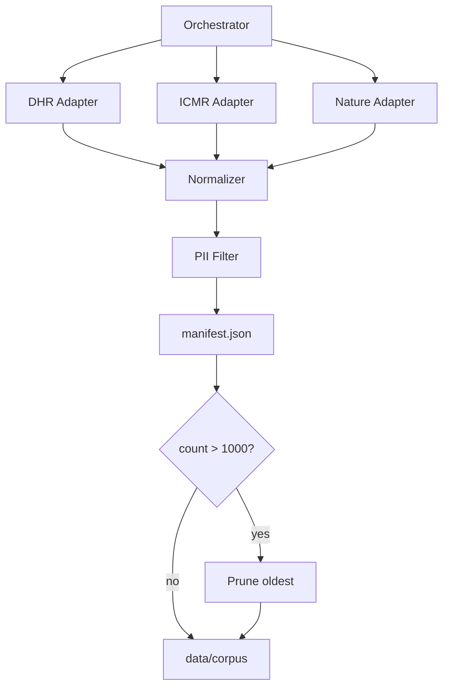
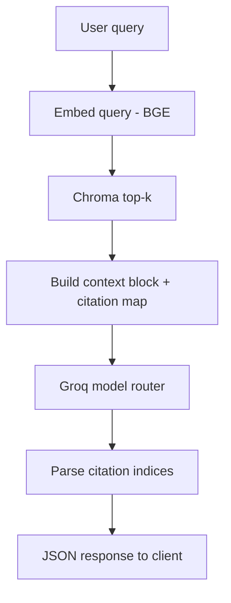
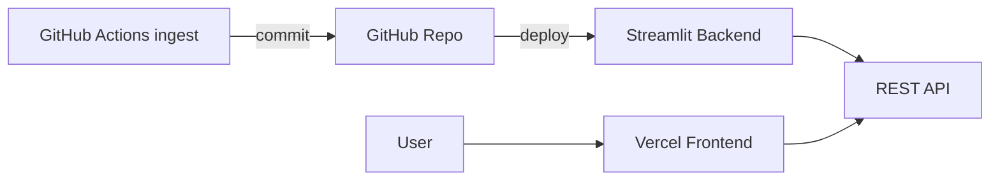
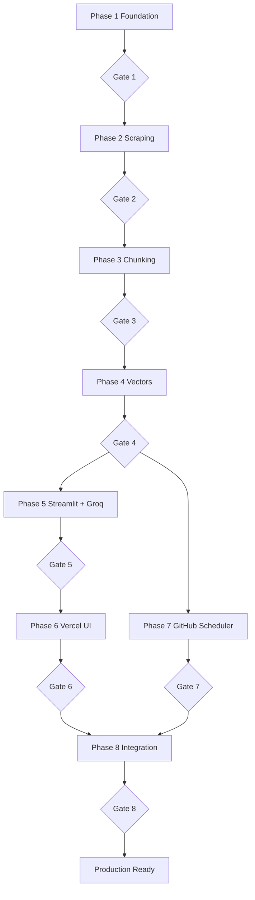

# CHATGPT Glass — Phase-Wise Architecture (Nature-only RAG + HITL)

**Document version:** 2.0  
**Aligned with:** [problemstatement.md](./problemstatement.md)  
**Last updated:** 2026-06-01

---

## Table of Contents

1. [Executive Summary](#1-executive-summary)
2. [System Context & Design Principles](#2-system-context--design-principles)
3. [Deployment Topology](#3-deployment-topology)
4. [High-Level Architecture](#4-high-level-architecture)
5. [Repository & Runtime Layout](#5-repository--runtime-layout)
6. [Phase Delivery Model & Deep Test Protocol](#6-phase-delivery-model--deep-test-protocol)
7. [Phase 1 — Foundation, Tooling & Project Scaffold](#7-phase-1--foundation-tooling--project-scaffold)
8. [Phase 2 — Corpus Ingestion & Scraping Service](#8-phase-2--corpus-ingestion--scraping-service)
9. [Phase 3 — Document Processing & Semantic Chunking](#9-phase-3--document-processing--semantic-chunking)
10. [Phase 4 — Vectorization & Local Vector Store](#10-phase-4--vectorization--local-vector-store)
11. [Phase 5 — RAG Backend (Streamlit) & Groq Generation](#11-phase-5--rag-backend-streamlit--groq-generation)
12. [Phase 6 — HITL Frontend (Vercel)](#12-phase-6--hitl-frontend-vercel)
13. [Phase 7 — GitHub Actions Scheduler](#13-phase-7--github-actions-scheduler)
14. [Phase 8 — Production Integration & Acceptance](#14-phase-8--production-integration--acceptance)
15. [Cross-Cutting Concerns](#15-cross-cutting-concerns)
16. [Data Schemas & Contracts](#16-data-schemas--contracts)
17. [Success Criteria Traceability](#17-success-criteria-traceability)
18. [Risks & Mitigations](#18-risks--mitigations)

---

## 1. Executive Summary

This architecture describes a **lightweight, India-focused medical RAG prototype** with a mandatory **Human-in-the-Loop (HITL)** gate: no answer may be copied, exported, or shared until every cited source is manually verified against on-disk evidence.

The system is delivered in **eight sequential phases (Phase 1 → Phase 8)**. **No work may begin on Phase N+1 until Phase N passes its Deep Test Gate** (see §6).

| Phase | Name | Primary outcome | Deploy target |
|-------|------|-----------------|---------------|
| **1** | Foundation & Scaffold | Repo, schemas, secrets, test harness | Local |
| **2** | Corpus Ingestion & Scraping | DHR, ICMR, Nature (7-day) scraper | Local + GHA (dry-run) |
| **3** | Semantic Chunking | 512-token / 80-overlap chunks | Local |
| **4** | Vectorization & Chroma | BGE-large, L2 norm, `chroma_db` | Local / artifact |
| **5** | RAG Backend & Groq LLM | Retrieval + generation + verification API | **Streamlit Cloud** |
| **6** | HITL Frontend | Two-pane validation + export gate | **Vercel** |
| **7** | Scheduled Ingest | Daily 6:00 AM IST pipeline | **GitHub Actions** |
| **8** | Integration & Acceptance | E2E across all deploy targets | Streamlit + Vercel + GHA |

**LLM provider:** [Groq API](https://console.groq.com/) (OpenAI-compatible), using **free-tier models with the highest token budgets** (see §11.3).  
**Vector store:** Chroma `PersistentClient` on disk only—no cloud vector DB.

---

## 2. System Context & Design Principles

### 2.1 Problem domain

Medical researchers and policy advisors need **authoritative, citeable** answers from national frameworks (DHR, ICMR) and recent global literature (Nature medical-research, last 7 days). Hallucinations and unverified exports create **clinical and legal risk** in India.

### 2.2 Design principles

| Principle | Implementation |
|-----------|----------------|
| **HITL by default** | `verification_status` on every chunk; export locked until all citations verified |
| **Local-first vectors** | Chroma `PersistentClient`; corpus on disk / repo artifacts |
| **Context-bound generation** | Groq LLM answers only from retrieved chunks; refuse if insufficient context |
| **Free-tier LLM optimization** | Model router picks Groq models with max TPM/TPD/RPD on free tier |
| **Zero PII retention** | Scraper and chunker reject/store no Aadhaar, PAN, patient names, credentials |
| **Bounded corpus** | Global cap of **1,000 documents**; prune oldest when full |
| **Temporal freshness** | Nature ingest **must** use `date_range=last_7_days` on every run |
| **Gated delivery** | Deep Test Gate after every phase before advancing |

| **Free & fast by design** | Free-tier only; CPU chunking; see [free-and-fast-alignment.md](./free-and-fast-alignment.md) |

### 2.3 External actors



---

## 3. Deployment Topology

Production splits across three platforms—each with a single responsibility.



| Component | Platform | URL pattern | Secrets |
|-----------|----------|-------------|---------|
| **Scheduler** | GitHub Actions | N/A (cron) | `HUGGINGFACE_API_TOKEN`, `GROQ_API_KEY` (if ingest needs LLM) |
| **Backend** | Streamlit Cloud | `https://<app>.streamlit.app` + API `https://<api-host>/api/v1` | `GROQ_API_KEY`, `HUGGINGFACE_API_TOKEN`, `CHROMA_PATH` |
| **Frontend** | Vercel | `https://<project>.vercel.app` | `NEXT_PUBLIC_BACKEND_URL`, public-only keys |

### 3.1 Streamlit backend deployment

- **App entry:** `backend/streamlit_app.py` — operational dashboard (health, ingest status, manual query smoke tests).
- **REST bridge:** `src/api/main.py` (FastAPI) started alongside Streamlit in `scripts/start_backend.sh` for Streamlit Cloud **custom** or supported multi-process hosting, so the **Vercel frontend never scrapes Streamlit HTML**—it calls JSON REST only.
- **Persistent storage:** Mount or bundle `chroma_db/` updated by GitHub Actions commits; Streamlit app reads the same path via `CHROMA_PATH`.

### 3.2 Vercel frontend deployment

- **Framework:** React + Vite or Next.js App Router (team choice; architecture assumes React + TypeScript).
- **Environment:** `NEXT_PUBLIC_BACKEND_URL` → Streamlit-hosted FastAPI base URL.
- **CORS:** FastAPI allows Vercel production + preview origins only.

### 3.3 GitHub Actions scheduler

- **Workflow:** `.github/workflows/daily-ingest.yml`
- **Schedule:** `cron: '30 0 * * *'` (06:00 IST)
- **Output:** Commits `chroma_db/**`, `data/manifest.json`, `data/ingest_log.jsonl` to the default branch for Streamlit to consume on next deploy/restart.

---

## 4. High-Level Architecture

### 4.1 Logical layers



### 4.2 Request lifecycle (query → verified export)



---

## 5. Repository & Runtime Layout

```
NL_Grad_ChatGPT/
├── .github/workflows/
│   └── daily-ingest.yml              # Phase 7 — scheduler
├── backend/
│   └── streamlit_app.py              # Phase 5 — Streamlit deploy entry
├── scripts/
│   └── start_backend.sh              # uvicorn + streamlit (Streamlit Cloud)
├── data/
│   ├── corpus/
│   ├── manifest.json
│   └── ingest_log.jsonl
├── chroma_db/
├── src/
│   ├── scraper/                      # Phase 2
│   ├── pipeline/                     # Phase 3–4
│   ├── api/                          # Phase 5 — REST for Vercel
│   │   ├── main.py
│   │   ├── routes/
│   │   ├── rag/
│   │   └── groq/
│   │       ├── client.py
│   │       └── model_router.py
│   └── shared/
│       ├── schemas.py
│       └── pii_filter.py
├── frontend/                         # Phase 6 — Vercel
│   ├── src/components/
│   └── vercel.json
├── tests/
│   ├── phase1/
│   ├── phase2/
│   └── ...                           # Mirror phase deep tests
├── docs/
│   ├── problemstatement.md
│   └── architecture.md
├── .env.example
├── requirements.txt
└── README.md
```

### 5.1 Environment variables

| Variable | Used in | Purpose |
|----------|---------|---------|
| `GROQ_API_KEY` | Streamlit backend | Groq chat completions |
| `GROQ_MODEL_PRIMARY` | Streamlit backend | Default high-TPD model (see §11.3) |
| `GROQ_MODEL_FALLBACK` | Streamlit backend | Fallback on 429 / deprecation |
| `HUGGINGFACE_API_TOKEN` | GHA + backend | BAAI/bge-large-en-v1.5 |
| `CHROMA_PATH` | All | Default `./chroma_db` |
| `CORPUS_PATH` | GHA | Default `./data/corpus` |
| `MAX_DOCUMENTS` | GHA | Default `1000` |
| `NEXT_PUBLIC_BACKEND_URL` | Vercel | Streamlit FastAPI base URL |

---

## 6. Phase Delivery Model & Deep Test Protocol

### 6.1 Sequential gate rule



**Rule:** If any Deep Test Gate fails, **stop**. Fix within the current phase, re-run the full gate checklist, then proceed.

### 6.2 Deep test layers (every phase)

| Layer | Tooling | Minimum bar |
|-------|---------|-------------|
| **Unit** | `pytest tests/phaseN/` | ≥90% pass on phase-scoped modules; no skipped critical tests |
| **Integration** | `pytest tests/phaseN/integration/` | Happy path + one failure path per external dependency |
| **Contract** | JSON schema / OpenAPI assertions | Request/response shapes stable for next phase |
| **Regression** | `pytest tests/regression/` (cumulative from Phase 2 onward) | All prior phase smoke tests still green |
| **Manual sign-off** | `docs/phase-reports/phase-N.md` | Checklist signed with date + commit SHA |

### 6.3 Phase report artifact

After each gate, commit `docs/phase-reports/phase-<N>-gate.md`:

```markdown
# Phase N — Deep Test Gate Report
- Date:
- Commit SHA:
- Unit tests: PASS / FAIL (count)
- Integration tests: PASS / FAIL
- Regression tests: PASS / FAIL
- Manual checks: [x] list
- Decision: PROCEED TO PHASE N+1 / BLOCKED
```

---

## 7. Phase 1 — Foundation, Tooling & Project Scaffold

### 7.1 Objectives

Establish monorepo structure, shared schemas, secret templates, test layout, and deployment stubs for **Streamlit**, **Vercel**, and **GitHub Actions**—without implementing business logic yet.

### 7.2 Sub-phases

#### Phase 1.1 — Repository scaffold

| Task | Output |
|------|--------|
| Python 3.11+ layout | `src/`, `tests/`, `requirements.txt` |
| Frontend stub | `frontend/` with Vite or Next.js baseline |
| Streamlit stub | `backend/streamlit_app.py` with health page |
| API stub | `src/api/main.py` with `GET /health` |
| GHA stub | `.github/workflows/daily-ingest.yml` (disabled or `workflow_dispatch` only) |

#### Phase 1.2 — Shared contracts

- `src/shared/schemas.py`: `DocumentRecord`, `ChunkMetadata`, `VerificationStatus`, `GroqChatRequest`
- Chroma metadata template matching PRD fields
- OpenAPI skeleton auto-generated from FastAPI

#### Phase 1.3 — Secrets & configuration

- `.env.example` documenting all keys (§5.1)
- `st.secrets` template for Streamlit Cloud (`secrets.toml.example`)
- Vercel env documentation in `frontend/README.md`
- GitHub Actions secrets list in root `README.md`

#### Phase 1.4 — PII filter foundation

- `src/shared/pii_filter.py`: regex/heuristics for Aadhaar, PAN, phones, emails
- Unit fixtures with positive/negative samples

#### Phase 1.5 — Test harness bootstrap

- `pytest.ini`, `tests/phase1/`, `tests/conftest.py`
- `tests/regression/.gitkeep`
- CI job `test-phase1.yml` on pull request

### 7.3 Phase 1 — Deep Test Gate

| # | Test | Pass criteria |
|---|------|---------------|
| 1.5.1 | `pytest tests/phase1/` | 100% pass |
| 1.5.2 | `GET /health` locally | Returns `{"status":"ok"}` |
| 1.5.3 | Streamlit local run | App loads health page without error |
| 1.5.4 | Frontend `npm run build` | Build succeeds on Vercel-compatible settings |
| 1.5.5 | Chroma init smoke | `PersistentClient` creates `india_medical_local` collection |
| 1.5.6 | PII filter | All fixture cases pass |
| 1.5.7 | Phase report | `docs/phase-reports/phase-1-gate.md` committed |

**Proceed to Phase 2 only if all rows pass.**

---

## 8. Phase 2 — Corpus Ingestion & Scraping Service

### 8.1 Objectives

Headless scraper for **DHR**, **ICMR**, and **Nature** (`date_range=last_7_days` mandatory), **1,000-document cap**, newest-first with pruning.

### 8.2 Sub-phases

#### Phase 2.1 — Ingest orchestrator

- `src/scraper/scheduler.py` — CLI entry for local and GHA
- `data/manifest.json` schema versioning
- `data/ingest_log.jsonl` audit lines per source per run

#### Phase 2.2 — DHR adapter

- URL: `https://www.dhr.gov.in/documents/publications?page=1`
- Paginate `page=N`; parse links; sort by published date descending

#### Phase 2.3 — ICMR adapter

- URL: `https://www.icmr.gov.in/reports`
- Extract latest report PDF/HTML links and core text blocks

#### Phase 2.4 — Nature adapter (critical)

- URL **must** include `date_range=last_7_days`
- `tests/phase2/test_nature_url.py` asserts query string at build time

#### Phase 2.5 — Normalization, PII filter, storage



#### Phase 2.6 — Pruning policy

1. Sort manifest by `publication_date` desc (tie-break: `ingested_at`).
2. When `len(documents) > 1000`, delete oldest files + manifest rows.
3. Emit `pruned_document_ids` list for Phase 4 Chroma cascade delete.

**Manifest record:**

```json
{
  "document_id": "sha256:...",
  "source_org": "ICMR",
  "source_url": "https://www.icmr.gov.in/...",
  "document_title": "...",
  "publication_date": "2026-05-15",
  "ingested_at": "2026-06-01T00:30:00Z",
  "content_type": "pdf",
  "local_path": "data/corpus/icmr/....pdf",
  "chronological_rank": 42
}
```

### 8.3 Phase 2 — Deep Test Gate

| # | Test | Pass criteria |
|---|------|---------------|
| 2.7.1 | Adapter unit tests | Mocked HTML fixtures for all three sources |
| 2.7.2 | Live smoke (optional flag) | ≥1 document per source ingested in staging |
| 2.7.3 | Cap enforcement | Synthetic 1001 docs → manifest length 1000, oldest removed |
| 2.7.4 | Nature URL audit | Log line contains `date_range=last_7_days` |
| 2.7.5 | PII rejection | Injected Aadhaar sample blocked |
| 2.7.6 | Regression | Phase 1 gate tests still pass |
| 2.7.7 | Phase report | `phase-2-gate.md` |

---

## 9. Phase 3 — Document Processing & Semantic Chunking

> **Detailed spec:** [architecture-phase-3-chunking.md](./architecture-phase-3-chunking.md)

### 9.1 Objectives

Convert corpus files into semantically coherent chunks: **max 512 tokens**, **80-token overlap**, rich metadata including `exact_context`.

### 9.2 Sub-phases

#### Phase 3.1 — Text extraction

| Source type | Tooling |
|-------------|---------|
| PDF | `pypdf`, `pdfplumber` |
| HTML | `beautifulsoup4` |

Output: normalized plain text per page.

#### Phase 3.2 — Structure detection

- Heading/section heuristics for guideline PDFs
- Section boundary map per document

#### Phase 3.3 — Structural segmentation (production default)

> PRD “semantic chunking” = **section- and sentence-aware** packing, not fixed character windows.  
> Embedding-based sentence merge is **optional v1.1** (e.g. Nature-only), not enabled in v1.

```
1. Use SectionSpan boundaries from Phase 3.2 (never cross sections).
2. Split section text into sentences (abbreviation-safe: Dr., e.g., No.).
3. Pack sentences into TextUnits until ~400 tokens (soft max).
4. Phase 3.4 applies hard 512 cap + 80-token overlap → final chunks.
```

**Code:** `StructuralSegmenter` in `src/pipeline/chunking/segmentation/semantic_segmenter.py`

#### Phase 3.4 — Token enforcement & overlap

- tiktoken `cl100k_base`; max **512** tokens; **80** overlap between adjacent chunks
- Split oversized units at sentence boundaries

#### Phase 3.5 — Chunk identity & metadata

- `chunk_id`: `{document_id}::p{page}::c{index}`
- `exact_context`: verbatim excerpt for `<mark>` highlighting
- `verification_status`: default `unverified`

#### Phase 3.6 — Pipeline CLI

- `python -m src.pipeline.chunking.run --manifest data/manifest.json`
- Outputs `data/chunks/{document_id}.jsonl`

### 9.3 Phase 3 — Deep Test Gate

| # | Test | Pass criteria |
|---|------|---------------|
| 3.6.1 | Token ceiling | No chunk > 512 tokens on ICMR sample PDF |
| 3.6.2 | Overlap integrity | Contraindication fixture spans overlap region |
| 3.6.3 | Metadata completeness | All required fields present on every chunk |
| 3.6.4 | Idempotency | Re-run produces identical `chunk_id` set |
| 3.6.5 | Regression | Phases 1–2 gates pass |
| 3.6.6 | Phase report | `phase-3-gate.md` |

---

## 10. Phase 4 — Vectorization & Local Vector Store

> **Detailed spec:** [architecture-phase-4-embedding.md](./architecture-phase-4-embedding.md)

### 10.1 Objectives

Embed chunks with **BAAI/bge-large-en-v1.5** (Hugging Face Inference API), **L2-normalize**, persist in **Chroma PersistentClient**.

### 10.2 Sub-phases

#### Phase 4.1 — Embedding client

- `src/pipeline/embeddings/bge_client.py`
- Batch requests with exponential backoff on 429/5xx

#### Phase 4.2 — L2 normalization

\[
\mathbf{v}_{\text{norm}} = \frac{\mathbf{v}}{\|\mathbf{v}\|_2}, \quad \|\mathbf{v}\|_2 = 1
\]

#### Phase 4.3 — Chroma integration

```python
import chromadb

client = chromadb.PersistentClient(path="./chroma_db")
collection = client.get_or_create_collection(
    name="india_medical_local",
    metadata={"hnsw:space": "cosine"},
)
```

#### Phase 4.4 — Upsert & cascade delete

- Upsert by `chunk_id`
- On prune: delete all chunks for `document_id` in `pruned_document_ids`

#### Phase 4.5 — Index verification tooling

- `scripts/verify_chroma.py` — count, sample query, persistence restart test

### 10.3 Metadata payload (required)

| Field | Type |
|-------|------|
| `source_url` | string |
| `document_title` | string |
| `publication_year` | int |
| `page_number` | int |
| `exact_context` | string |
| `verification_status` | `unverified` \| `verified` |
| `source_org` | DHR \| ICMR \| Nature |
| `chunk_id` | string |

### 10.4 Phase 4 — Deep Test Gate

| # | Test | Pass criteria |
|---|------|---------------|
| 4.6.1 | Embedding dimensions | Consistent with bge-large output size |
| 4.6.2 | L2 norm test | `abs(norm - 1.0) < 1e-5` per vector |
| 4.6.3 | Offline query | Top-k retrieval with no remote vector DB |
| 4.6.4 | Restart persistence | Kill process; data still queryable |
| 4.6.5 | Prune cascade | Delete doc → zero chunks remain in Chroma |
| 4.6.6 | Regression | Phases 1–3 gates pass |
| 4.6.7 | Phase report | `phase-4-gate.md` |

---

## 11. Phase 5 — RAG Backend (Streamlit) & Groq Generation

### 11.1 Objectives

Implement retrieval + **Groq** context-only generation, verification session state, export gate—deployed on **Streamlit Cloud** with REST endpoints consumed by Vercel in Phase 6.

### 11.2 Sub-phases

#### Phase 5.1 — Groq client & OpenAI-compatible SDK

- `src/api/groq/client.py` using `groq` Python SDK or `openai` client with `base_url=https://api.groq.com/openai/v1`
- Env: `GROQ_API_KEY`

#### Phase 5.2 — Free-tier model router (maximum token allowance)

Groq free-tier limits are **per model** (RPM, TPM, TPD, RPD). Re-check [console.groq.com/settings/limits](https://console.groq.com/settings/limits) before production; limits change.

**Selection policy:** Prefer models with the **highest TPM and TPD** on the free tier that fit the RAG context window. Use a **primary + fallback** chain on `429 Too Many Requests`.

| Priority | Model ID | Free-tier highlights (indicative) | Role |
|----------|----------|-----------------------------------|------|
| **Primary** | `meta-llama/llama-4-scout-17b-16e-instruct` | ~30K TPM, ~500K TPD, large context (~512K) | Main RAG answers—fits many retrieved chunks in one prompt |
| **Fallback A** | `llama-3.1-8b-instant` | ~14.4K RPD, ~500K TPD, 128K context | High daily request volume; smaller answers |
| **Fallback B** | `llama-3.3-70b-versatile` | Higher quality; lower RPD (~1K) | Complex clinical synthesis when Scout rate-limited |
| **Avoid for bulk** | `openai/gpt-oss-120b` | Lower TPD (~200K) on free tier | Use only if explicitly needed |

```python
# src/api/groq/model_router.py (conceptual)
MODEL_CHAIN = [
    os.getenv("GROQ_MODEL_PRIMARY", "meta-llama/llama-4-scout-17b-16e-instruct"),
    os.getenv("GROQ_MODEL_FALLBACK", "llama-3.1-8b-instant"),
    "llama-3.3-70b-versatile",
]

def chat_with_fallback(messages, max_tokens=4096):
    for model in MODEL_CHAIN:
        try:
            return groq_client.chat.completions.create(
                model=model, messages=messages, max_tokens=max_tokens, temperature=0.1
            )
        except RateLimitError:
            continue
    raise RuntimeError("All Groq models rate-limited")
```

**Token budgeting for free tier:**

- Cap retrieved context to ~6–8 chunks × ~512 tokens to stay under TPM per request.
- Set `max_tokens` output ≤ 2048 unless answer requires more (Groq max output often 8,192—stay conservative to preserve daily TPD).
- Log `x-ratelimit-remaining-tokens` headers for observability.

#### Phase 5.3 — RAG orchestrator

Pre-LLM **relevance gate** (`api/rag/relevance_gate.py`): when top-hit cosine similarity or query–chunk term overlap is below `rag_ooc_min_similarity` / `rag_ooc_min_term_overlap`, return the Pinky Promise without calling Groq. Post-LLM: model refusals or answers without `[n]` citations also trigger Pinky Promise.

Chunk text is sanitized at ingest (`metadata.py`) and in the HTML extractor (Nature sidebar/share widgets stripped) so embeddings index prose, not UI noise. Re-run chunking + Chroma upsert after extractor changes.



#### Phase 5.4 — REST API (Vercel-facing)

| Method | Path | Purpose |
|--------|------|---------|
| `POST` | `/api/v1/query` | NL query → answer + citations |
| `GET` | `/api/v1/chunks/{chunk_id}` | Sanitized `exact_context` + metadata (Nature share/citation UI stripped via `sanitize_display_context`) |
| `PATCH` | `/api/v1/sessions/{session_id}/verify/{chunk_id}` | Mark verified |
| `GET` | `/api/v1/sessions/{session_id}/export-gate` | Export lock state **for that query session only** |
| `GET` | `/api/v1/suggestions` | Verified-topic suggestion chips (out-of-corpus UX) |
| `GET` | `/api/v1/starter-prompts` | Landing-page demo prompts (2 corpus + 1 off-topic) |
| `GET` | `/health` | Liveness |

#### Phase 5.5 — Groq system prompt guardrails

- Answer **only** from provided context blocks.
- Numbered citations `[1]`, `[2]` mapped to `chunk_id`.
- **Refuse** if context insufficient—no fabrication.
- **Prohibited:** individual diagnoses, direct prescriptions, treatment mandates.
- Fixed disclaimer in every response footer.

#### Phase 5.6 — Streamlit operational app

- `backend/streamlit_app.py`: health dashboard, manual query tester, Chroma stats, Groq model status (remaining rate limits if headers available)
- Deploy to **Streamlit Cloud**; secrets via `st.secrets`
- `scripts/start_backend.sh` runs FastAPI + Streamlit

### 11.3 Phase 5 — Deep Test Gate

| # | Test | Pass criteria |
|---|------|---------------|
| 5.7.1 | Groq integration | Mock + live smoke: completion returned |
| 5.7.2 | Refusal test | Out-of-corpus → Pinky Promise message + 3 verified suggestions; no fabrication |
| 5.7.3 | Model fallback | Simulated 429 → next model in chain succeeds |
| 5.7.4 | Retrieval latency | top-10 < 500ms on demo index (local disk) |
| 5.7.5 | Export gate API | Per `session_id`; `allowed` when all **cited** indices in that answer are verified |
| 5.7.6 | Streamlit Cloud deploy | `/health` reachable on public URL |
| 5.7.7 | CORS | Vercel preview origin allowed in staging |
| 5.7.8 | Regression | Phases 1–4 gates pass |
| 5.7.9 | Phase report | `phase-5-gate.md` |

---

## 12. Phase 6 — CHATGPT Glass Frontend (Vercel)

### 12.1 Objectives

Single-page **CHATGPT Glass** prototype on **Vercel**, calling the FastAPI backend. Copy/share remain locked until **100%** of cited sources are verified.

### 12.2 Sub-phases

#### Phase 6.1 — Vercel project setup

- `frontend/vercel.json` — build command, output dir, env vars
- `NEXT_PUBLIC_BACKEND_URL` → Phase 5 API base

#### Phase 6.2 — Landing + conversation UI

- Landing: title + tagline + glass search + 3 fresh starter prompts (refreshed per New chat):
  1. latest-article corpus question (verifiable),
  2. "Show me all research on <date>" for a random date just before the oldest article (demonstrates the not-found → top-3 fallback),
  3. one off-topic prompt (Pinky Promise demo)
- LIST-by-date: valid date → up to `rag_list_max_documents` (3) article links; unavailable date → "Sorry, we don't have any articles for <date>… try our top 3 articles" with 3 verifiable citations
- Conversation: input clears after response; response shows **You asked** then the draft answer
- Suggestions-first: show the top 3 clickable **You might like** options before the answer
- Answer render with clickable `[n]` citations
- Source matrix with trust nudge (open article → click **Verify**) → verified state
- **Indexed corpus count** and coverage notes are API-only (not shown in the UI)

#### Phase 6.3 — Verification UX

- Citation row includes **Open article** link to Nature HTML
- Verify via trust nudge → `PATCH` verify endpoint

#### Phase 6.4 — Export gate UI

- Toolbar: **Share** (platform logos only: X, WhatsApp, Facebook, Teams) and **Copy answer**
- Share shows **platform logos only** (prototype; no external share API calls)
- No Markdown export download
- Disabled until `export-gate.allowed === true`
- Tooltip explaining HITL requirement

#### Phase 6.5 — Layout wireframe

```
┌─────────────────────────────────────────────────────────────────────────┐
│                   CHATGPT Glass — HITL prototype (Vercel)                │
├─────────────────────────────────────────────────────────────────────────┤
│  Landing: title + tagline + pill search + 3 starter prompts (vertical)   │
│  (2 corpus demos from manifest + 1 off-topic from 5; refreshed per chat)  │
├─────────────────────────────────────────────────────────────────────────┤
│  Conversation: You asked + suggestions + answer + citations + verify     │
│  You might like · Share logos (prototype) · Copy — LOCKED until verified │
└─────────────────────────────────────────────────────────────────────────┘
```

### 12.3 Phase 6 — Deep Test Gate

| # | Test | Pass criteria |
|---|------|---------------|
| 6.6.1 | Playwright E2E | Query → verify all → export enabled |
| 6.6.2 | Export lock E2E | Unverified citation → copy button disabled |
| 6.6.3 | Highlight speed | Sandbox `<mark>` on click < 200ms perceived |
| 6.6.4 | Vercel preview deploy | Preview URL loads; API calls succeed |
| 6.6.5 | Production deploy | Production URL + CORS verified |
| 6.6.6 | Accessibility | Buttons and lock state have ARIA labels |
| 6.6.7 | Regression | Phases 1–5 gates pass |
| 6.6.8 | Phase report | `phase-6-gate.md` |

---

## 13. Phase 7 — GitHub Actions Scheduler

### 13.1 Objectives

Daily ingest at **6:00 AM IST** (`cron: '30 0 * * *'` UTC): scrape → chunk → embed → upsert → test → commit artifacts for Streamlit backend.

### 13.2 Sub-phases

#### Phase 7.1 — Workflow definition

```yaml
name: Daily Medical Corpus Ingest
on:
  schedule:
    - cron: '30 0 * * *'   # 06:00 IST
  workflow_dispatch:

jobs:
  ingest:
    runs-on: ubuntu-latest
    steps:
      - uses: actions/checkout@v4
      - uses: actions/setup-python@v5
        with:
          python-version: '3.11'
      - run: pip install -r requirements.txt
      - run: python -m src.scraper.scheduler
        env:
          HUGGINGFACE_API_TOKEN: ${{ secrets.HUGGINGFACE_API_TOKEN }}
      - run: python -m src.pipeline.chunking.run
      - run: python -m src.pipeline.index.chroma_upsert
        env:
          HUGGINGFACE_API_TOKEN: ${{ secrets.HUGGINGFACE_API_TOKEN }}
      - run: pytest tests/phase7/ tests/phase2/test_nature_url.py -v
      - uses: stefanzweifel/git-auto-commit-action@v5
        with:
          commit_message: 'chore(ingest): daily corpus and chroma sync'
          file_pattern: chroma_db/** data/manifest.json data/ingest_log.jsonl
```

#### Phase 7.2 — Post-ingest validation step

- Assert Nature URL in log
- Assert `len(manifest) <= 1000`
- Chroma document count smoke test

#### Phase 7.3 — Artifact handoff to Streamlit

- Document in README: Streamlit redeploy or restart after GHA commit
- Optional: `repository_dispatch` webhook to trigger Streamlit redeploy

#### Phase 7.4 — Secrets & safety

- Never log tokens
- `GITHUB_TOKEN` for commit only; no force-push to `main`

### 13.3 Phase 7 — Deep Test Gate

| # | Test | Pass criteria |
|---|------|---------------|
| 7.5.1 | `workflow_dispatch` dry-run | Job green end-to-end |
| 7.5.2 | Nature URL test | Passes in CI log |
| 7.5.3 | Commit artifacts | `chroma_db` + manifest updated in repo |
| 7.5.4 | Prune overflow test | Forced 1001 → stable 1000 after job |
| 7.5.5 | 3-day schedule (staging) | 3 consecutive cron successes OR manual simulation |
| 7.5.6 | Regression | Phases 1–6 gates pass |
| 7.5.7 | Phase report | `phase-7-gate.md` |

---

## 14. Phase 8 — Production Integration & Acceptance

### 14.1 Objectives

Validate **Streamlit + Vercel + GitHub Actions** together; enforce privacy; sign off PRD success criteria.

### 14.2 Sub-phases

#### Phase 8.1 — Cross-platform E2E



- Full journey: GHA ingest → Streamlit picks up new `chroma_db` → Vercel query → verify → export

#### Phase 8.2 — Security & privacy audit

- [ ] No PII in corpus or Chroma metadata
- [ ] Secrets only in Streamlit / Vercel / GHA secret stores
- [ ] CORS locked to known Vercel domains
- [ ] Groq prompts resist basic injection (refuse out-of-scope instructions)

#### Phase 8.3 — Performance validation

| Metric | Target |
|--------|--------|
| Sandbox highlight | < 200ms on citation click |
| Vector reads | No remote vector DB timeouts |
| Daily ingest | < 30 min on `ubuntu-latest` at 1k cap |

#### Phase 8.4 — PRD success criteria sign-off

Map all four PRD criteria in §17 with evidence links in root `README.md`.

### 14.3 Phase 8 — Deep Test Gate (final)

| # | Test | Pass criteria |
|---|------|---------------|
| 8.5.1 | Full E2E production | GHA → Streamlit → Vercel path green |
| 8.5.2 | PRD criterion 1 | Export blocked with unverified citations |
| 8.5.3 | PRD criterion 2 | Chroma local-only reads under load |
| 8.5.4 | PRD criterion 3 | Instant `<mark>` highlight |
| 8.5.5 | PRD criterion 4 | Nature 7-day proof in `ingest_log.jsonl` |
| 8.5.6 | Full regression suite | `pytest` all phases |
| 8.5.7 | Phase report | `phase-8-gate.md` — **PRODUCTION READY** |

---

## 15. Cross-Cutting Concerns

### 15.1 Observability

- Structured logging: ingest counts, prune deletions, Groq model used, rate-limit headers
- `ingest_log.jsonl`: one JSON line per source per GHA run

### 15.2 Error handling

| Failure | Behavior |
|---------|----------|
| HF API down | Retry 3×; fail GHA job; do not commit broken index |
| Groq 429 | Model router fallback chain; UI shows retry message |
| Streamlit API down | Vercel shows maintenance state |
| Scraper HTML change | Adapter version flag; GHA fails loud |

### 15.3 Versioning

- `manifest.json` → `schema_version`
- Chroma collection metadata → `schema_version`

---

## 16. Data Schemas & Contracts

### 16.1 Chunk metadata (Chroma)

```python
metadata_payload = {
    "source_url": "https://www.icmr.gov.in/pdf/guidelines/tb_protocol_2026.pdf",
    "document_title": "National Operational Guidelines for Pulmonary Tuberculosis - Update",
    "publication_year": 2026,
    "page_number": 24,
    "exact_context": "For multi-drug resistant strains, administer Bedaquiline under strictly monitored DOTS context...",
    "verification_status": "unverified",
    "source_org": "ICMR",
    "chunk_id": "sha256:abc::p24::c3",
}
```

### 16.2 Query response

```json
{
  "session_id": "uuid",
  "answer": "According to national guidelines [1], ...",
  "citations": [
    {
      "index": 1,
      "chunk_id": "sha256:abc::p24::c3",
      "document_title": "...",
      "verification_status": "unverified"
    }
  ],
  "model_used": "meta-llama/llama-4-scout-17b-16e-instruct",
  "out_of_corpus": false,
  "suggested_queries": []
}
```

**Out-of-corpus** (`out_of_corpus: true`): `answer` is exactly  
`I made a Pinky promise that I will never ever give Inavlid response`  
followed by human-readable topic lines; `suggested_queries[]` carries `label` + `query` for clickable chips (POST the same `query` string).

### 16.3 Export gate response

```json
{
  "allowed": false,
  "total": 1,
  "verified": 0,
  "pending_indices": [2]
}
```

`total` / `pending_indices` count only citation indices **referenced in the answer** (e.g. `[2]`), not every retrieved chunk. Each `POST /query` creates a new `session_id`; verifying or exporting one question never affects another.

---

## 17. Success Criteria Traceability

| PRD criterion | Phase(s) | Verification |
|---------------|----------|--------------|
| **Strict verification isolation** | 5, 6, 8 | API + Playwright: export blocked until all verified |
| **Zero cloud vector DB crashes** | 4, 8 | Chroma `PersistentClient` only; offline read test |
| **Targeted highlighting speed** | 6, 8 | `<mark>` on citation click < 200ms |
| **Nature rolling 7-day sync** | 2, 7, 8 | URL unit test + daily `ingest_log.jsonl` audit |

---

## 18. Risks & Mitigations

| Risk | Impact | Mitigation |
|------|--------|------------|
| Groq free-tier rate limits | Failed queries during demo | Model router + context token budget + queue/retry UX |
| Streamlit + API co-hosting | Vercel cannot reach backend | FastAPI sidecar; document `BACKEND_URL` clearly |
| `chroma_db` repo size | Slow clones | Git LFS; 1k doc cap; prune |
| Government site HTML changes | Broken ingest | Adapter fixtures; fail GHA loudly |
| Groq model deprecation | 400 errors | `GET /models` health check in Phase 5 gate |
| Legal misuse | Liability | Prompt refusals + UI disclaimer |

---

## Appendix A — Technology Stack

| Layer | Choice | Deploy |
|-------|--------|--------|
| Scraper | Python + httpx + BeautifulSoup | GitHub Actions |
| Chunking | Semantic + tiktoken | GitHub Actions |
| Embeddings | BAAI/bge-large-en-v1.5 (HF Inference) | GitHub Actions + Streamlit |
| Vector DB | Chroma PersistentClient | Disk / repo artifact |
| LLM | **Groq API** (Llama 4 Scout primary) | Streamlit backend |
| Backend surface | **Streamlit** + FastAPI REST bridge | Streamlit Cloud |
| Frontend | React + TypeScript | **Vercel** |
| Scheduler | GitHub Actions cron | **GitHub** |
| Tests | pytest + Playwright | CI per phase gate |

---

## Appendix B — Phase Dependency Graph



---

*Architecture v2.0 — Phases 1–8 with mandatory Deep Test Gates. Update `docs/phase-reports/` after each gate.*
