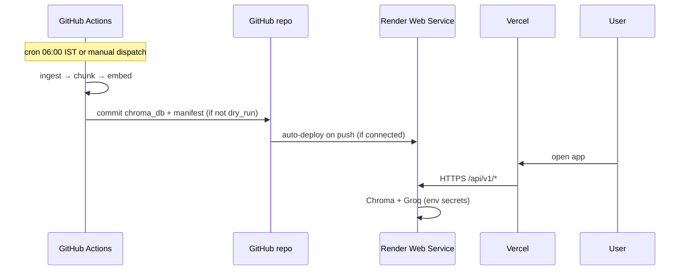

# Deployment Plan — ChatGPT Glass Prototype

**Target topology**

| Layer | Platform | Responsibility |
|-------|----------|----------------|
| **Scheduler** | GitHub Actions | Daily Nature ingest → chunk → embed → commit `chroma_db/` + `data/` |
| **Backend API** | [Render](https://render.com) | FastAPI (`src/api/main.py`) — RAG, verify, health |
| **Frontend** | [Vercel](https://vercel.com) | Vite/React HITL UI (`frontend/`) |

**Architecture reference:** [architecture.md](./architecture.md) §3 · **Workflow:** `.github/workflows/daily-ingest.yml` · **Render blueprint:** `render.yaml`

---

## 1. End-to-end flow



**Prototype shortcut (recommended first):** keep GHA on `dry_run=true` (fixture + mock embed), ship `chroma_db/` from git, set `EMBED_MOCK=true` and `GROQ_API_KEY` on Render only for live answers. Skip `HUGGINGFACE_API_TOKEN` until you want real daily embeddings in CI.

---

## 2. Prerequisites checklist

- [ ] GitHub repo with `main` branch (e.g. `prateek12rai/NL_Grad_ChatGPT`)
- [ ] [Groq API key](https://console.groq.com/) for production answers
- [ ] (Optional) Hugging Face token — only for **live** scheduled embed in GHA (`dry_run=false`)
- [ ] Render account (free tier OK for demo)
- [ ] Vercel account (Hobby tier OK)

---

## 3. Action plan — Scheduler (GitHub Actions)

### 3.1 One-time setup

1. Open **Settings → Secrets and variables → Actions** on GitHub.
2. Add secrets (prototype vs production):

| Secret | Prototype | Production ingest |
|--------|-----------|-------------------|
| `HUGGINGFACE_API_TOKEN` | Skip | Required for `dry_run=false` embed step |
| `GROQ_API_KEY` | Optional | Optional (ingest does not require Groq today) |

3. Confirm workflow exists: `.github/workflows/daily-ingest.yml`.
4. **Actions → Daily Medical Corpus Ingest → Run workflow**
   - **Prototype:** `dry_run` = `true` (default) — fixture ingest, `EMBED_MOCK=true`, no git commit.
   - **Production:** `dry_run` = `false` — live Nature scrape, real embed (needs HF token), commits artifacts.

### 3.2 What the workflow does

| Step | Output |
|------|--------|
| Ingest | Updates `data/corpus/`, `data/manifest.json` |
| Chunk | `data/chunks/**` |
| Embed + upsert | `chroma_db/` |
| Phase 7 tests | Offline pytest |
| Commit | Only when `dry_run != true` |

### 3.3 Cron schedule

- **Expression:** `30 0 * * *` (UTC) → **06:00 IST** daily
- **Scheduled runs** use `dry_run` automatically (fixture + mock embed + no commit) — same as manual prototype runs.
- Manual **Run workflow** with `dry_run=false` when you want live Nature ingest + git commit.

### 3.3.1 Why GitHub shows “Artifacts: 0”

This workflow does **not** upload [Actions Artifacts](https://docs.github.com/en/actions/writing-workflows/choosing-what-your-workflow-does/storing-workflow-data-as-artifacts). Corpus updates are saved by **committing to git** (`chroma_db/`, `data/`) when `dry_run=false`. With `dry_run=true`, the commit step is skipped — **0 artifacts is expected** and does not mean the job failed.

### 3.4 Handoff to Render

After a **non–dry-run** commit, Render redeploys automatically if the service is linked to the same repo and branch. No extra step unless you use a **Deploy Hook** (optional; see §6).

---

## 4. Action plan — Backend (Render)

### 4.1 Deploy from Blueprint (fastest)

1. Render Dashboard → **New → Blueprint**.
2. Connect the GitHub repo; Render reads root `render.yaml`.
3. Set **secret** env vars in the dashboard (not in git):

| Variable | Required | Example / notes |
|----------|----------|-----------------|
| `GROQ_API_KEY` | Yes (live answers) | From Groq console |
| `GROQ_MOCK` | Prototype | `false` when key set |
| `EMBED_MOCK` | Prototype | `true` — uses committed Chroma; no HF at runtime |
| `CORS_ORIGINS` | Yes | `https://your-app.vercel.app,https://your-app-*.vercel.app` — add **production + preview** URLs after Vercel step |
| `HUGGINGFACE_API_TOKEN` | No (prototype) | Only if `EMBED_MOCK=false` and you embed on Render |

4. Deploy. Note the public URL, e.g. `https://chatgpt-glass-api.onrender.com`.

**If blueprint sync fails:** use **`region: oregon`** (not Singapore) on the free tier. Delete the failed `chatgpt-glass-api` service under the blueprint, push latest `main`, then **Manual Sync** the blueprint again.

### 4.2 Deploy manually (without Blueprint)

| Setting | Value |
|---------|--------|
| **Type** | Web Service |
| **Runtime** | Python 3.11 |
| **Root directory** | `.` (repo root) |
| **Build command** | `pip install -r requirements.txt` |
| **Start command** | `PYTHONPATH=./src uvicorn api.main:app --host 0.0.0.0 --port $PORT` |
| **Health check path** | `/health` |

### 4.3 Verify backend

```bash
curl https://<your-render-host>/health
```

Expect JSON with `"status":"ok"` and `chroma` not `unreachable`.

### 4.4 Chroma / disk notes

- `chroma_db/` is **committed** in this repo so each deploy includes the index from git.
- Render free tier: filesystem is **ephemeral** per instance, but **each deploy clones fresh git** — fine while the index lives in the repo.
- For heavy write workloads later, add a Render **persistent disk** or external vector store.

### 4.5 Streamlit (optional)

`backend/streamlit_app.py` remains for **local ops only**. Production UI talks to **FastAPI on Render**, not Streamlit.

---

## 5. Action plan — Frontend (Vercel)

### 5.1 One-time setup

1. Vercel → **Add New Project** → import the same GitHub repo.
2. **Root Directory:** `frontend`
3. **Framework Preset:** Vite (matches `frontend/vercel.json`)
4. **Build command:** `npm run build` (default)
5. **Output directory:** `dist`

### 5.2 Environment variables (Vercel)

| Variable | Value |
|----------|--------|
| `VITE_BACKEND_URL` | `https://<your-render-host>` — **no trailing slash** |

Redeploy after changing env vars (Vite bakes `VITE_*` at build time).

### 5.3 Wire CORS on Render

Copy your Vercel URLs from **Deployments**:

- Production: `https://<project>.vercel.app`
- Preview: `https://<branch>-<team>.vercel.app` (pattern varies)

Set on Render:

```env
CORS_ORIGINS=https://<prod>.vercel.app,http://localhost:5173,http://localhost:5174
```

Add each preview origin you use, or redeploy Render after first Vercel preview URL is known.

### 5.4 Verify frontend

1. Open Vercel production URL.
2. DevTools → Network: `POST` to `https://<render>/api/v1/rag/query` (or starter prompts) should be **200**, not CORS error.
3. Ask a medical question → answer + citations.
4. **Verify** flow → export gate unlocks copy.

---

## 6. Integration sequence (recommended order)

| Step | Owner | Action |
|------|--------|--------|
| 1 | You | Push repo; run GHA `dry_run=true` once (sanity) |
| 2 | Render | Deploy API; set `GROQ_*`, `EMBED_MOCK=true`, `CORS_ORIGINS` with localhost only |
| 3 | Vercel | Deploy UI; set `VITE_BACKEND_URL` to Render URL |
| 4 | Render | Update `CORS_ORIGINS` with Vercel prod (+ preview) URLs; redeploy |
| 5 | You | E2E test: question → verify → copy |
| 6 | (Later) | GHA `dry_run=false` + HF token; confirm Render auto-redeploy picks new `chroma_db` |

### Optional: Render deploy hook after GHA commit

If auto-deploy on push is off, add a Render **Deploy Hook** URL as a GitHub secret `RENDER_DEPLOY_HOOK` and append a workflow step (commented template in `daily-ingest.yml`).

---

## 7. Environment matrix

| Variable | GHA | Render | Vercel |
|----------|-----|--------|--------|
| `PYTHONPATH` | `src` | `src` | — |
| `CHROMA_PATH` | `./chroma_db` | `./chroma_db` | — |
| `EMBED_MOCK` | `true` if dry_run | `true` (prototype) | — |
| `GROQ_API_KEY` | — | Secret | — |
| `GROQ_MOCK` | `true` in tests | `false` (live) | — |
| `HUGGINGFACE_API_TOKEN` | Secret if live ingest | Optional | — |
| `CORS_ORIGINS` | — | Vercel URLs | — |
| `VITE_BACKEND_URL` | — | — | Render URL |

---

## 8. Phase 8 acceptance (production path)

Use [PHASES/Phase-08-Integration/CHECKLIST.md](../PHASES/Phase-08-Integration/CHECKLIST.md):

- [ ] GHA ingest commit lands on `main` (or prototype: committed `chroma_db` in repo)
- [ ] `GET /health` on Render returns OK
- [ ] Vercel UI loads and calls API without CORS errors
- [ ] Verify + export gate per PRD
- [ ] Nature source links open HTML (not PDF preview)

---

## 9. Troubleshooting

| Symptom | Likely cause | Fix |
|---------|----------------|-----|
| CORS error in browser | `CORS_ORIGINS` missing Vercel URL | Add exact origin on Render, redeploy |
| 502 / cold start | Render free spin-down | Wait ~30s; retry; upgrade plan if needed |
| Empty RAG / pinky only | Chroma empty or wrong path | Confirm `chroma_db/` in repo; `CHROMA_PATH=./chroma_db` |
| API URL wrong in UI | Stale Vercel build | Set `VITE_BACKEND_URL`, **redeploy** Vercel |
| GHA succeeds but app stale | No commit (dry_run) or Render not linked | `dry_run=false` or push manually; check Render auto-deploy |
| Chroma telemetry warnings in GHA logs | Chroma client noise | Safe to ignore |

---

## 10. Cost summary (prototype)

| Service | Typical cost |
|---------|----------------|
| GitHub Actions | Free for public repos |
| Render | Free tier with sleep; paid for always-on |
| Vercel | Hobby free for personal projects |
| Groq | Free tier limits; monitor console |
| Hugging Face | Skip for prototype (`EMBED_MOCK`) |

---

## 11. Related files

| File | Purpose |
|------|---------|
| `render.yaml` | Render Blueprint |
| `frontend/vercel.json` | SPA rewrites + Vite build |
| `frontend/.env.example` | Local / doc for `VITE_BACKEND_URL` |
| `.env.example` | Backend env template |
| `.github/workflows/daily-ingest.yml` | Scheduler |

**Last updated:** 2026-06-02 — Render backend (replaces Streamlit Cloud in production path).
